# 제작 기록 — 디자인 편

무엇을 바꿨는지가 아니라 **왜 그렇게 바꿨는지**를 남긴다.
버린 안과 그걸 버린 이유까지 적는다. 나중에 같은 자리에서 같은 고민을 다시 하지 않으려고.

측정값이 나오는 곳은 전부 실제로 재본 수치다. 취향 다툼이 될 만한 자리에서는
숫자를 먼저 놓고 결정했다.

---

## 화면

전부 `430 × 932` (iPhone 14 Pro Max) @2x. 캡처 방법은 [맨 아래](#8-스크린샷-자동-캡처)에.

### 리메이크 — MODERN

민트 바디에 둥근 모서리, Paperlogy. 아트워크를 카드 밖으로 꺼내 화면을 넓게 쓴다.

| 플레이어 | 캐러셀 | 그리드 | 리스트 |
|:--:|:--:|:--:|:--:|
| 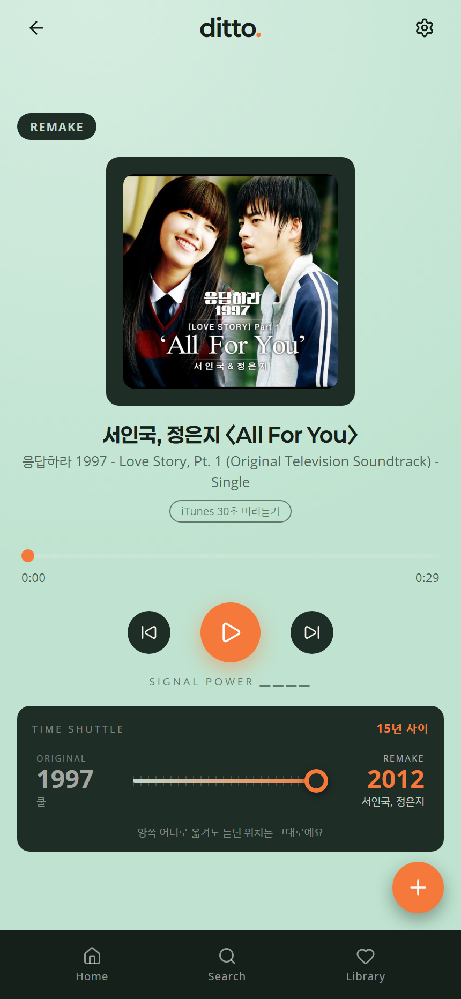 | 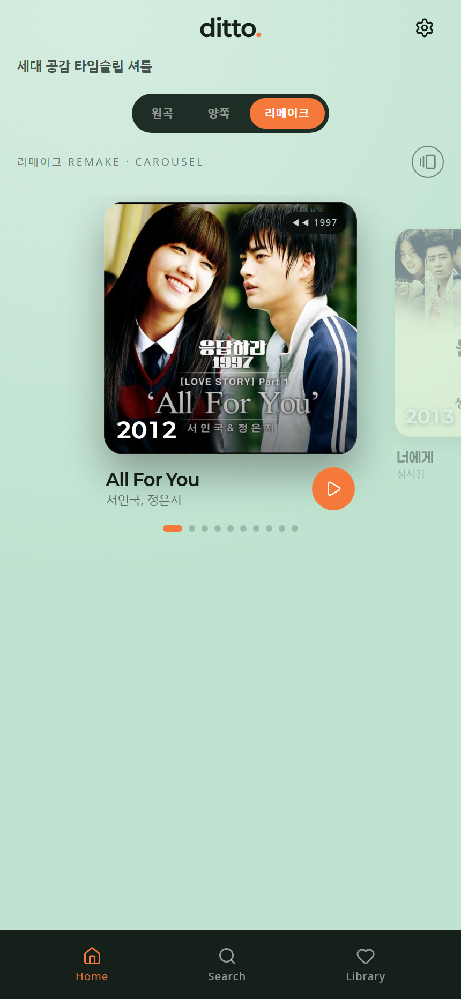 | 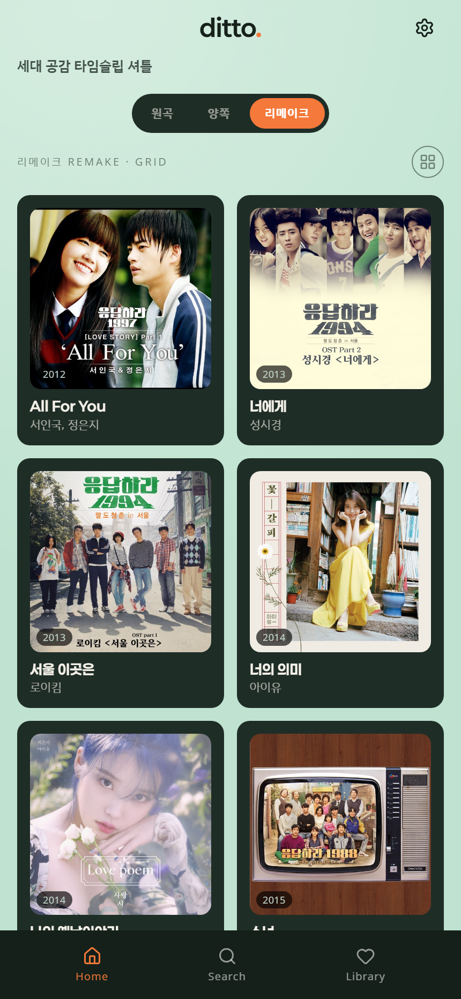 | 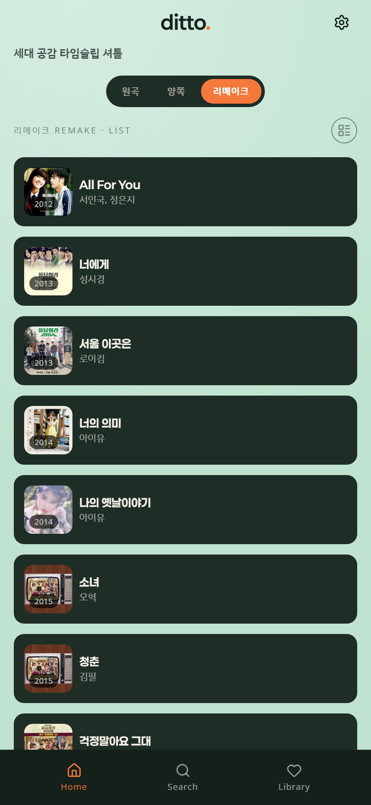 |
| 셔틀 콘솔 · 15년 사이 | 뱃지가 `◀◀ 1997` — 갈 수 있는 곳 | | |

### 원곡 — RETRO

같은 초록의 어두운 끝. 픽셀 서체(Galmuri), 각진 모서리, 그레인, 하드웨어 디테일.
목록 레이아웃은 **MP3AMP(기본) · TUNER 둘**이다 — 같은 기기의 화면 두 장.

| 플레이어 | MP3AMP — 같은 기기, 화면만 WINAMP | TUNER — 휴대용 MP3 |
|:--:|:--:|:--:|
| 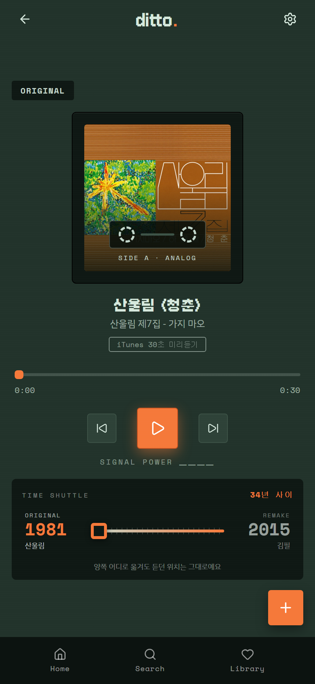 | 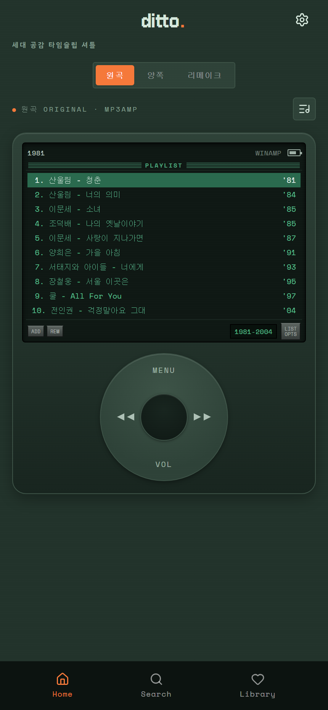 | 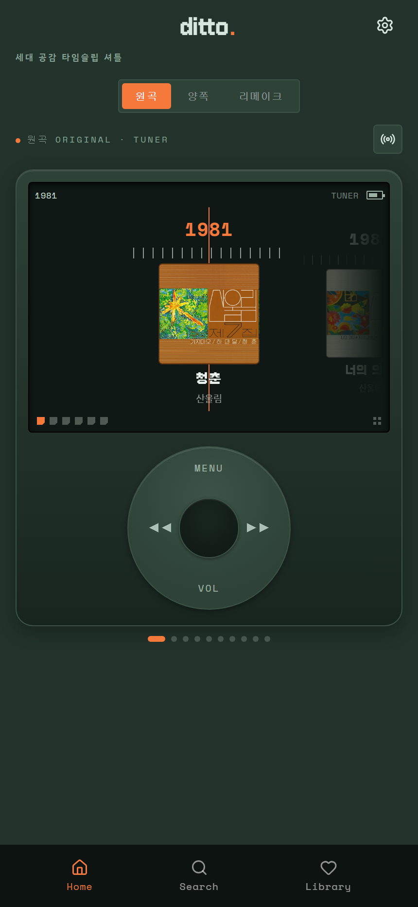 |
| 사각 페이더 캡 · 카세트 오버레이 | 휠이 세로 목록을 넘긴다 — 실물 아이팟이 하던 짓 | 파묻힌 LCD + 클릭휠. 연도가 곧 주파수 |

### WINAMP 스킨

형태는 90년대 원본, 색은 ditto 팔레트. 목록뿐 아니라 화면 전체를 덮는다.
창을 기기 밖으로 꺼내는 쪽이다 — 지금은 [노출에서 뺐다](#노출에서-뺀-레이아웃).

| 홈 (세 창) | 플레이어 |
|:--:|:--:|
| 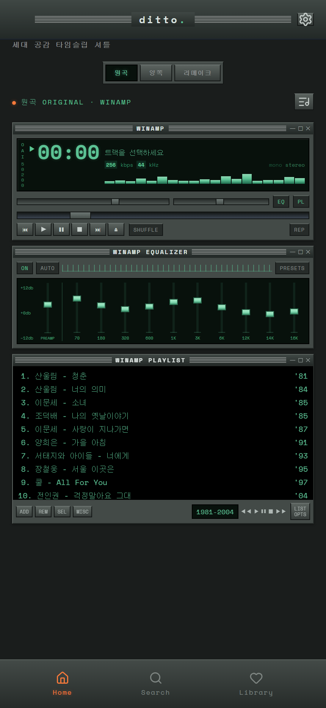 | 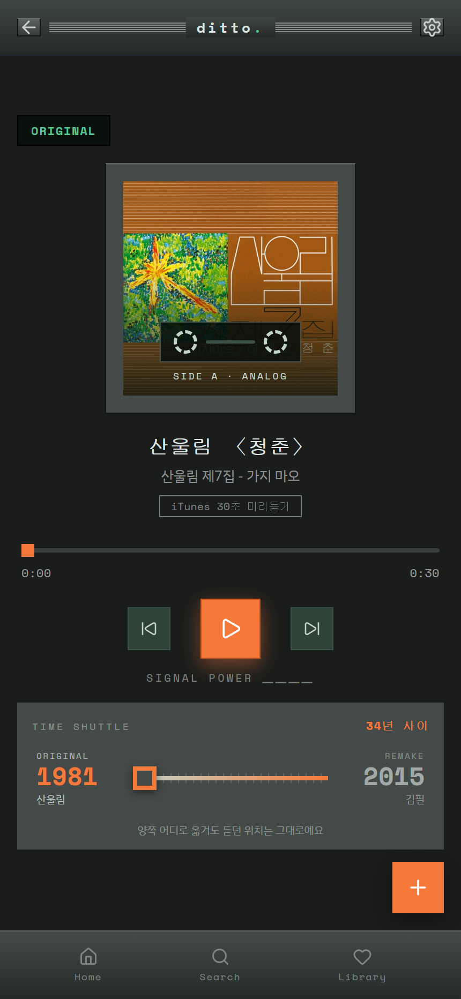 |
| 무채색 섀시 + 창 안쪽에만 인광 | 스킨이 다른 화면까지 따라간다 |

#### 노출에서 뺀 레이아웃

원곡 목록을 추리면서 아래 셋은 tweak 버튼 순환에서 뺐다.
지우지는 않았다 — 렌더러와 CSS 가 그대로 있어서 `ERA.original.layouts` 배열에
이름만 되돌리면 다시 살아난다.

| RACK — EP-133 패드 그리드 | DIAL — 부채꼴 회전 휠 | WINAMP — 전면 스킨 |
|:--:|:--:|:--:|
| 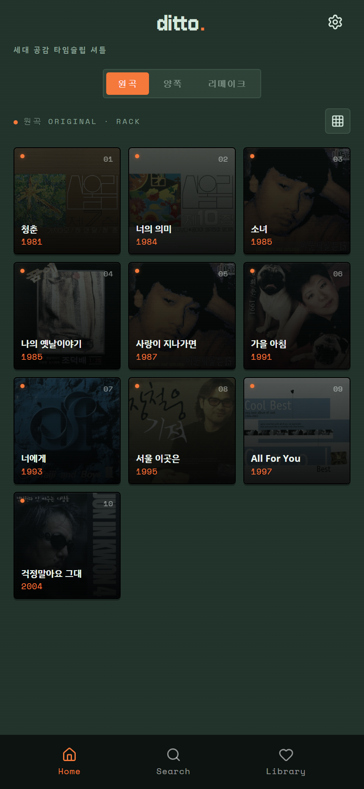 | 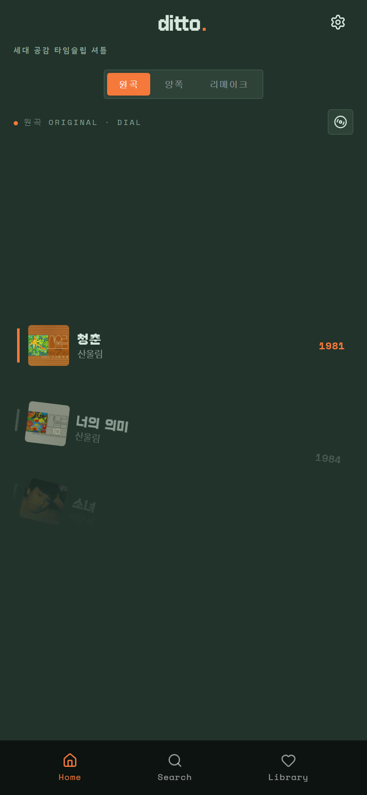 |  |
| 3×3 패드 · LED · 실크스크린 번호 | 중심에서 멀수록 기울고 흐려지는 다이얼 | 창이 기기 밖으로 나온 판. [16번](#16-winamp-을-순환에서-뺐다) |

### 양쪽 — 한 화면에 두 시대

| |
|:--:|
| 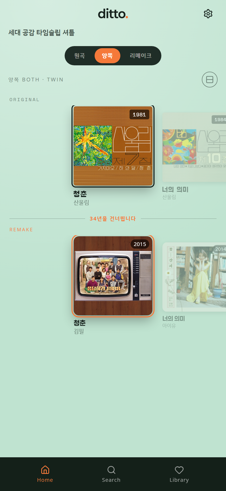 |
| 바탕이 화면 맨 위 과거에서 아래 현재로 번진다. 쓰던 세 색만 섞은 메시 그라디언트.<br>위 줄은 픽셀 서체·각진 모서리, 아래 줄은 Paperlogy·둥근 모서리.<br>가운데 다리가 두 곡의 연차를 말한다 — **34년을 건너뜁니다** |

### 타임슬립 전환

방향이 보인다 — 과거로는 차갑게 줄무늬가 오른쪽으로, 현재로는 따뜻하게 왼쪽으로.
가운데 연도는 출발 연도에서 도착 연도로 굴러간다.

| 과거로 | 현재로 |
|:--:|:--:|
| 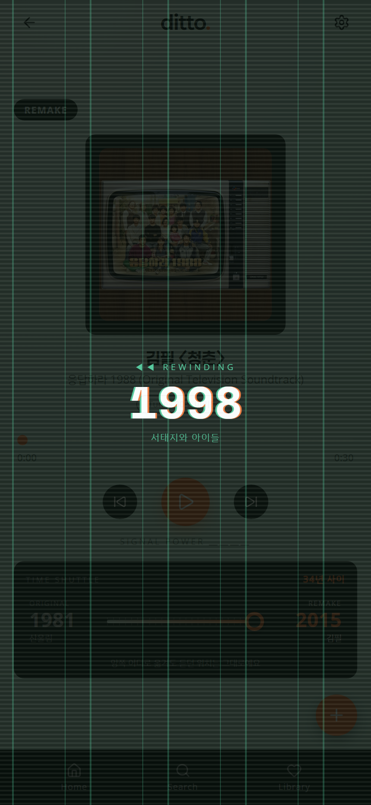 | 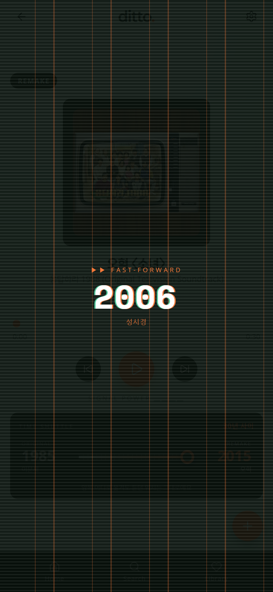 |

### 공통 화면

| 검색 | 라이브러리 | 설정 |
|:--:|:--:|:--:|
| 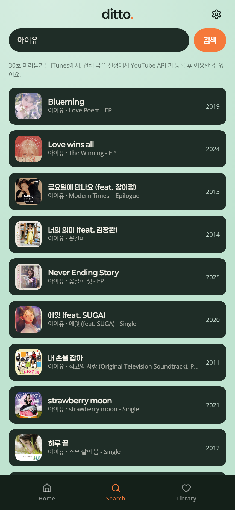 | 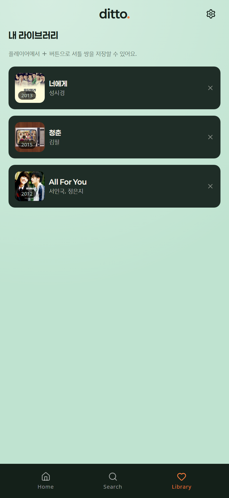 | 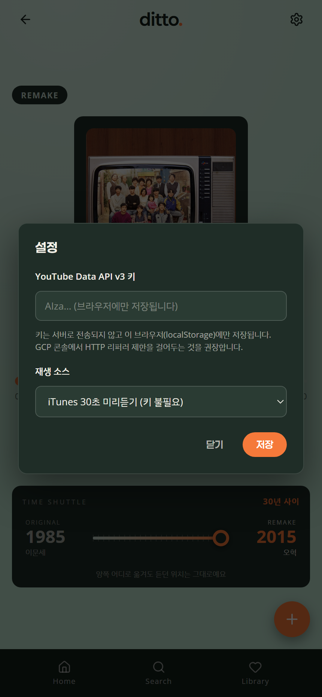 |
| 입력창도 결과 행과 같은 판 | | 예전엔 하드코딩 크림이라 떠 있었다 |

---

## 0. 출발점

앱은 이미 굴러가고 있었다. 문제는 완성도가 아니라 **컨셉이 화면에 안 보인다**는 것이었다.

- 주제는 '타임 셔틀' — 다른 시대, 다른 가수가 만든 같은 곡 사이를 오가는 것.
- UI 컨셉은 둘 — 원곡은 레트로/Y2K, 리메이크는 모던.
- 그런데 이 둘이 **다른 앱처럼** 보였고, 정작 '시간 이동'은 화면 어디에도 드러나지 않았다.

감사에서 나온 것들:

| 갈래 | 문제 |
|---|---|
| 주제 | 연도는 장식으로만 있고 **두 곡 사이의 거리**를 보여주는 곳이 없었다 |
| 주제 | 셔틀이 앱의 존재 이유인데 플레이어에서 가장 눈에 안 띄는 요소였다 (6px 슬라이더) |
| 주제 | 전환 연출이 과거·미래 방향 구분 없이 동일했다 |
| 분리 | 모던 화면의 라벨 40%가 모노스페이스(Space Mono) — 모던이 레트로 목소리로 말하고 있었다 |
| 분리 | `border-radius` 선언 **60개 중 토큰을 쓴 건 5개** — 모서리로 시대를 가르겠다는 설계가 실제로는 작동하지 않았다 |
| 일관성 | WINAMP 스킨이 팔레트를 통째로 갈아엎었다 (스틸블루 + `#22E03A`) |
| 일관성 | `--color-beige #E5D5AE` 가 전역 토큰이라 모던 화면까지 카키로 물들였다 |
| 일관성 | 오렌지가 두 개 (`#F5793A` / `#F04E23`), 재생 버튼 글로우는 하드코딩 |
| 일관성 | 설정 모달이 하드코딩 크림 `#FDF8EC` — 민트 화면 위의 이물질 |
| 버그 | TUNER 레이아웃이 아예 렌더되지 않고 있었다 (아래 참조) |

---

## 1. 팔레트 — 한 팔레트의 양 끝

"색은 모던 것으로 통일하되, 시대 구분은 유지하고 싶다"가 요구였다.
RETRO 를 모던 팔레트 쪽으로 **얼마나** 끌어올지가 진짜 질문이라 세 안을 만들어 비교했다.

| 안 | 내용 | 결과 |
|---|---|---|
| SHARED | RETRO 가 MODERN 과 토큰 값이 완전히 동일. 시대는 서체·모서리·질감만 담당 | 일관성 최대, 그러나 필터를 바꿔도 색이 그대로라 셔틀의 극적인 순간이 죽는다 |
| TINT | 크림 바디를 민트 기운 오프화이트로 재보정 | 변경 최소, 그러나 두 스킨 실루엣이 '밝은 바디 + 짙은 카드'로 수렴해 차이가 가장 흐리다 |
| **INVERT** ✅ | 색상환은 그대로 두고 **명도만 반대쪽 끝으로** | 팔레트는 하나로 묶이면서 과거는 깊게 / 현재는 밝게 — 시대가 색으로도 읽힌다 |

INVERT 를 골랐다. 결정적인 이유는 **셔틀 때문**이다.
두 스킨이 같은 색이면 시간 이동의 순간에 화면이 변하지 않는다.
같은 초록 램프의 양 끝에 두면 팔레트는 하나로 유지되면서 이동은 눈에 보인다.

```
MODERN(현재)  바디 #BFE3D0 민트   ·  카드 #1F2D27
RETRO (과거)  바디 #22332B 짙은 초록 ·  카드 #0F1814  ← 바디보다 더 어두운 '파묻힌 디스플레이'
```

세 안 모두가 공유하기로 한 규칙:

- **오렌지는 앱 전체에 하나** (`#F5793A`). RETRO 의 `#F04E23` 삭제.
- **`--color-beige` 삭제** → `--color-text-on-card-dim #C2D6CB` (민트 계열).
- **카드·내비는 두 스킨이 같은 값**. 이 공통의 어두운 판이 '한 앱'의 뼈대다.

---

## 2. 토큰 — 구분을 색이 아닌 형태에 맡기다

색을 통일한 만큼, 시대 구분의 부담이 서체와 모서리로 넘어왔다.
그런데 둘 다 토큰으로 작동하지 않고 있어서 먼저 배선부터 했다.

### 모서리

`--radius-card` 하나뿐이던 것을 역할별로 쪼갰다.

```
--radius-card / -art / -art-lg / -ctl / -field / -round
MODERN  12px / 10px / 18px / 999px / 8px / 50%
RETRO    6px /  4px /  6px /   3px / 2px /  4px
```

토큰 적용률 **5/60 → 35/51**. 남은 것은 진짜 원형(카세트 릴, LED)과 WINAMP 스킨의 명시적 `0`.
이제 RETRO 에서 FAB·칩·슬라이더 손잡이까지 각지게 떨어진다 — 예전에는 카드에서 멈췄다.

### 서체

`--font-label` 을 새로 뒀다. 라벨·캡션·수치가 쓰는 서체다.

```
RETRO   Space Mono      (기기 실크스크린)
MODERN  Open Sans       (본문 서체 + 넓은 자간)
```

모노스페이스는 그 자체가 레트로 신호다. 모던 화면의 절반을 모노로 칠하면
모던이 안 모던해지는 동시에 두 스킨의 대비도 죽는다. 이제 모노는 RETRO 전용이다.

### 부분에만 시대 입히기

`.era-past` / `.era-present` — **색은 건드리지 않고 서체와 모서리만** 바꾸는 토큰 묶음.
한 화면에 두 시대가 같이 서는 자리(양쪽 보기)에서 쓴다.

---

## 3. WINAMP — 두 번 고쳤다

### 1차: 형태는 두고 ditto 팔레트로

원본의 스틸블루 크롬 + 형광 초록 `#22E03A` 는 앱의 어떤 화면과도 이어지지 않았다.
창·베벨·EQ·플레이리스트라는 **형태**는 그대로 두고 색만 갈아입혔다.

### 그런데 눈이 아팠다

"레트로 느낌은 좋은데 색이 눈을 피곤하게 한다"는 피드백. 재보니 원인이 분명했다.

| 진단 | 수치 |
|---|---|
| **색상환이 한 점에 뭉쳤다** | 토큰 10개 중 9개가 **13° 폭**(143–156°) 안에 — 온 화면이 한 가지 초록 |
| **창이 바탕에서 안 떨어졌다** | 섀시 대 바탕 **1.44:1** — 창 경계를 1px 베벨 혼자 감당 |
| **인광이 너무 뜨겁고, 창 밖까지 샜다** | `#5FE3A8` 채도 70% / 명도 63% / **12.2:1**, 그것도 5.5px 라벨에까지. 곡 제목·검색창·토스트까지 초록 |
| **디스플레이 안에서 보색이 부딪혔다** | 오렌지 채도 90%, 인광과 **133° 차이** — EQ 손잡이 11개가 초록 라벨 사이에서 진동 |

원본 WINAMP 가 눈에 편했던 이유는 **차가운 회색 섀시 + 작고 밝은 초록 디스플레이**라는
색상 대비였다. 섀시까지 초록으로 칠하면서 그 관계를 부순 게 실수였다.

### 2차: 관계를 복원

| | 전 | 후 |
|---|---|---|
| 섀시 채도 | 18 / 14 / 20% | **5 / 4 / 5%** |
| 창 대 바탕 | 1.44:1 | **1.87:1** |
| LCD 대 창 | 1.83:1 | **2.11:1** |
| 인광 눈부심 | 12.2:1 @ 채도 70% | **8.8:1 @ 채도 46%** |
| EQ 손잡이 대 인광 | 채도 90%, 133° | **채도 55%, 1°** |
| 스펙트럼 최고 밝기 | 채도 80% | **채도 49%** |

핵심은 세 가지.

1. **섀시를 무채색에 가깝게** 빼서 뒤로 물렸다.
2. **바탕을 어둡게 하는 대신 창을 밝게** 했다. 둘 다 시험해봤는데, 바탕을 어둡게 하면
   창 분리는 1.64:1 에서 멈추고 LCD 가 바탕과 **1.00:1** 로 붙어버렸다.
3. **인광을 창 밖으로 내보내지 않는다.** 곡 제목·섹션 제목·검색창·토스트는 평범한 글자색으로.
   진짜 LCD 사각형 안에서만 빛나야 '디스플레이'로 읽힌다.

부수적으로 **선택행의 주황을 걷어냈다.** 원본의 파랑이 통했던 건 초록과 색상이 달라서였는데,
거기에 주황을 넣으면 보색이라 더 심해진다. 인광 계열 안에서 반전시켰다.

> 아직 열린 선택지: 인광을 **앰버**로 바꾸는 안. 앰버는 역사적으로 가장 눈이 편한
> 터미널 인광이고, 마침 ditto 의 오렌지와 **같은 색 계열**(약 20° 차이)이라 지금의
> 133° 대치가 사라진다. 대신 "그건 초록이지"라는 WINAMP 의 기억과는 멀어진다.

---

## 4. 타임 셔틀 — 주제를 실제로 보이게

### 셔틀 콘솔

6px 슬라이더 + 맨숫자 두 개였던 것을 **정거장 두 개를 가진 콘솔**로 바꿨다.
각 정거장은 시대 · 연도 · **그 시절의 가수**를 보여준다. 마지막 항목이 특히 중요했다 —
"다른 시대, 다른 가수"가 컨셉의 절반인데 UI 가 한 번도 말한 적이 없었다.

- 정거장이 **버튼**이다. 목적지가 둘뿐인데 드래그만 강요할 이유가 없다.
- 슬라이더와 버튼 모두 `travelTo()` 하나로 모으고 **재진입 가드**를 걸었다.
  크로스페이드가 겹치면 두 음원이 같이 들린다.
- 서 있는 정거장에 불이 들어온다. 슬라이더 위치만으로는 상태가 안 읽혔다.
- 레일에 눈금을 깔았다 — 두 정거장 사이가 '시간'이라는 신호.

### 방향이 있는 전환

전환은 이 앱에서 시간 이동이 실제로 일어나는 유일한 순간인데,
예전엔 어느 쪽으로 가든 똑같고 글자만 달랐다.

```
과거로  ◀◀ REWINDING      줄무늬 오른쪽으로 · 차가운 쪽(--color-accent-cool)
현재로  ▶▶ FAST-FORWARD    줄무늬 왼쪽으로  · 따뜻한 쪽(--color-accent)
```

그리고 가운데 **연도가 실제로 굴러간다.** 출발 연도에서 도착 연도까지 700ms,
크로스페이드(800ms)보다 살짝 먼저 도착하도록 감속을 걸었다.
실측: `2012 → 2006 → 2001 → 1999 → 1998 → 1997`.

줄무늬는 간격이 다른 두 겹을 겹쳤다. 한 겹만 촘촘히 깔았더니 가로 스캔라인과 만나
모눈종이처럼 보였다 — 움직임이 아니라 격자로 읽혔다.

### 연차를 숫자로

- 플레이어 콘솔 — `15년 사이`
- 양쪽 보기 — 두 줄 사이의 다리에 `34년을 건너뜁니다` (끄는 동안 실시간 갱신)
- 홈 카드 뱃지 — 고정된 시대 이름(`REMAKE`) 대신 **갈 수 있는 곳**: `◀◀ 1997`

### 연대순 정렬

홈 목록을 보고 있는 시대의 연도 오름차순으로 세웠다.
TUNER 다이얼과 DIAL 휠이 '연표'로 읽히려면 순서 자체가 시간이어야 한다.
이전/다음 곡도 화면에 보이는 순서를 따라가게 맞췄다.

```
원곡    1981 → 2004
리메이크 2012 → 2017
```

### 양쪽 보기가 편을 들지 않게

`both` 가 RETRO 테마로 렌더되고 있었다 — 두 시대를 같이 보는 화면인데 과거 편을 든 셈.
이제 앱의 기본 판 위에서 각 줄이 `.era-past` / `.era-present` 를 입는다.
**같은 팔레트, 한 화면, 두 시대.** 디자인 시스템이 의도대로 도는지 보여주는 자리이기도 하다.

---

## 5. 고친 버그

- **TUNER 가 렌더되지 않았다.** `applyLayout()` 이 붙이는 `.rail` 클래스에 **CSS 규칙이 아예 없었다.**
  스크롤 규칙이 `.carousel` 에만 있어서 TUNER 는 세로 격자로 쏟아졌다.
  규칙을 `.pair-list.rail` 로 옮겼다. `scrollHeight 2391px → 243px`, 가로 `scrollWidth 2640px`.
  이 앱에서 가장 강한 시간 은유인데 한 번도 작동한 적이 없었다.
- **DIAL** `330px` → `462px`, 패딩을 `(높이 − 한 칸)/2` 로 잡아 활성 항목이 정확히 중앙에.
- **플레이어 여백** 약 30%가 아래에만 몰려 있던 것을 `justify-content: safe center` 로 나눴다.
  (`safe` 를 쓰는 이유: 내용이 넘칠 때 `center` 는 위쪽을 스크롤로 닿을 수 없게 만든다)
- **`SELECTED` → `REMAKE`** — 오른쪽은 언제나 리메이크지 '선택된 것'이 아니다.
- 한글 글리프가 잘리던 문제 — `overflow:hidden` 자리에서 `line-height` 가 곧 클리핑 높이다.
- **양쪽 보기에서 앨범 아트 윗부분이 잘렸다.** `.twin-rail` 은 가로 스크롤이라
  `overflow-x: auto` 를 쓰는데, **한 축이 visible 이 아니면 나머지 축의 `visible` 은
  `auto` 로 계산된다** — 가로만 스크롤하려고 쓴 속성이 세로까지 자르고 있었다.
  활성 카드의 링(`outline: 2px` + `outline-offset: 2px`)은 아트 위로 4px 나가는데
  위 여백은 `2px` 뿐이라 정확히 `2px` 이 잘려 나갔다 (`ring 199.7 < rail 201.7`).
  여백을 `12px` 로 올리고 `margin-top: -10px` 으로 당겨 **아트 위치는 그대로**
  (`artTop 203.7` 동일), 링 위 여유 `8px`. 같은 패턴인 캐러셀은 링이 없고
  위 여백이 `31.9px` 이라 멀쩡했다 — 트윈만의 문제였다.

---

## 6. 개발 서버

`python dev_server.py` 가 `Python` 만 찍고 죽었다.
원인은 PATH 의 `python.exe` 가 **0바이트 Microsoft Store 별칭 스텁**이었던 것.
디스크 전체를 뒤져도 실제 인터프리터가 없었고 Node·PHP 도 없었다.

`.claude/dev_server.ps1` 을 뒀다. `System.Net.HttpListener` 로 `dev_server.py` 와 같은 일을 한다
(같은 `no-store` 헤더, MIME, 경로 이탈 차단). 파이썬을 설치하면 파이썬판이 정본이고 이건 지우면 된다.

작업하며 만난 두 함정:

- **HEAD 요청에 본문을 쓰면 500** — `Content-Length` 를 넘긴다.
- **http.sys 는 Host 헤더로 라우팅한다** — `localhost` 만 등록하면 `127.0.0.1` 로 오는 요청은
  400 을 받는다. 루프백 세 표기를 모두 등록했다.

이 서버는 `no-store` 를 보내므로 `index.html` 의 `?v=` 캐시 무효화가 필요 없다.

---

## 7. 기기 기준 · 첫 화면 · 아이콘 정렬

### 데스크톱 기준 기기를 iPhone 14 Pro Max 로

캔버스가 `390 × 985` 라는 실제로 존재하지 않는 크기였다.
데스크톱에서 열었을 때 보여줄 기준을 **iPhone 14 Pro Max (430 × 932pt)** 로 맞췄다.

폭을 `--canvas-w` 토큰으로 뺀 게 핵심이다. 캐러셀과 트윈 레일이 첫/마지막 카드를
중앙에 스냅시키려고 좌우 패딩을 `(캔버스폭 - 카드폭) / 2` 로 계산하는데,
여기에 `390px` 이 하드코딩돼 있어서 캔버스만 넓히면 스냅이 어긋났다.

반응형은 `.phone` 만 늘리면 안 되고 **토큰 자체**를 바꿔야 한다:

```css
@media (max-width: 480px) {
  :root { --canvas-w: 100vw; --canvas-h: 100dvh; }
}
```

실측(375px 뷰포트): 레일 좌측 패딩 `69.67px`, 중앙 정렬에 필요한 값 `69.5px` — 일치.

### 첫 화면 = 응답하라 주제곡

홈이 아니라 **'응답하라' 주제곡 하나가 걸린 플레이어**로 시작한다.
매번 다른 곡이 걸리게 뒀다 — 이 앱의 '발견' 성격에 맞고, 요청도 "중 하나"였다.

작업하다 발견한 것: 자동재생이 막혔을 때 **화면이 거짓말을 하고 있었다.**
`play()` 가 `.catch(() => {})` 로 거부를 삼키고 `state.playing = true` 를 그대로 세워서,
소리는 안 나는데 일시정지 아이콘이 떠 있었다. 엔진의 `play()` 가 성공 여부를
돌려주게 고쳐서, 막히면 정지 상태로 정직하게 표시한다.

> 브라우저는 사용자 제스처 없는 자동재생을 막는다. 첫 방문에서는 재생 버튼이 뜬
> 정지 상태로 보일 수 있고, 이건 우회할 수 없는 제약이다.

### 버튼 안 아이콘 정렬

눈으로 보고 고치지 않고 **전부 재서** 고쳤다.
버튼 중심과 아이콘 중심의 차이를 `getBoundingClientRect` 로 측정:

| 버튼 | 수정 전 | 수정 후 |
|---|---|---|
| 뒤로가기 · 설정 | dy **−2.33px** | 0.00 |
| 이전 · 다음 곡 | dy **−2.00px** | 0.00 |
| FAB | dy **−2.67px** | 0.00 |
| 재생(▶) | 0.00 | 0.00 |

재생 버튼만 멀쩡했던 게 단서였다. 그것만 `<svg>` 가 버튼의 **직계 자식**이고,
나머지는 `app.js` 가 `[data-icon]` **span 래퍼** 안에 svg 를 꽂는 구조다.
그 래퍼가 인라인 박스라 글자 베이스라인 아래 디센더 여백까지 높이에 잡혔고,
`.lucide { vertical-align: -2px }` 가 얹혀 아이콘이 2~3px 위로 떴다.

래퍼를 중앙 정렬 박스로 만들고 줄높이를 0 으로 눌러 여백을 없앴다.
본문 문장에 섞여 들어가는 `.inline-ico` 만 예외로 베이스라인 정렬을 남겼다.

**손대지 않은 것:** Lucide 가 이미 넣어둔 광학 보정.
오른쪽을 향한 삼각형은 기하 중심에 두면 왼쪽으로 치우쳐 보이는데,
`play` 아이콘의 잉크 중심이 `x = 13` (viewBox 중심 12)로 **이미 +1 보정**돼 있다.
`skip-back` / `skip-forward` / `plus` / `settings` 는 정확히 12로 대칭이었다.
기하학적으로 0 을 만드는 게 목적이 아니라 눈에 가운데로 보이는 게 목적이라 그대로 뒀다.

---

## 8. 스크린샷 자동 캡처

화면 16장을 손으로 찍지 않고 스크립트로 뽑았다. 디자인을 고칠 때마다 다시 찍어야 하는데
수동이면 그때마다 상태를 손으로 재현해야 하고, 결국 기록이 코드보다 뒤처진다.

문제는 **앱 상태가 전부 JS 로만 움직인다**는 것이었다. `?era=original&layout=winamp` 같은
URL 이 없으니 헤드리스 브라우저가 특정 화면을 열 방법이 없다.

그래서 같은 오리진 하네스(`tools/_build/shot.html`)를 만들었다. 앱을 iframe 으로 띄우고
그 안에서 상태를 만든 다음 `<html data-shot="ready">` 로 신호를 세우면, 헤드리스 크롬이
그때 찍는다. 같은 오리진이라 iframe 내부 DOM 을 그대로 조작할 수 있다는 점을 이용한 것.

```
chrome --headless=new --force-device-scale-factor=2
       --window-size=430,932 --virtual-time-budget=40000
       --screenshot=out.png "…/shot.html?screen=home&era=original&layout=winamp"
```

**두 번 틀렸고 두 번 고쳤다.**

1. **아트워크가 빈 사각형으로 찍혔다.** 고정 `sleep` 으로 기다렸는데, 레이아웃을 바꾸면
   목록이 다시 그려지면서 iTunes 매칭이 처음부터 다시 시작된다. 튜너 파일이 35KB 밖에
   안 되는 게 단서였다 → 아트워크가 실제로 붙을 때까지 폴링하도록 바꿨다.
2. **트윈 화면이 절반만 칠해진 채로 찍혔다.** `backgroundImage` 가 세팅된 것과 그림이 다
   그려진 것은 다르다 → `img.decode()` 로 디코드 완료까지 기다린다.
   트윈 217KB → 649KB, 리스트 187KB → 334KB.

파일 크기가 디버깅 단서가 됐다는 게 재밌는 부분이다. 화면을 눈으로 하나씩 확인하는 것보다
바이트 수를 훑는 쪽이 "뭔가 안 그려졌다"를 훨씬 빨리 잡아냈다.

> 하네스는 `tools/_build/` (gitignore 대상)에 있다. 빌드 산출물과 같은 취급 —
> 언제든 다시 만들 수 있고, 저장소에 남을 이유가 없다.

---

## 9. 원곡 레이아웃을 둘로 좁힘

원곡 목록에 하드웨어 레퍼런스 4종(RACK · WINAMP · TUNER · DIAL)을 넣어두고 tweak 버튼으로
돌려보게 해뒀었다. 탐색 단계에서는 맞는 방식이지만, 고르고 나면 남겨둘 이유가 없다 —
쓰는 사람 입장에서 tweak 버튼은 "다음에 뭐가 나올지 모르는 버튼"이 되고,
네 번 눌러야 원하는 화면으로 돌아온다.

**WINAMP 과 TUNER 만 남겼다.** 기본은 WINAMP.

- WINAMP — 원곡 시대를 가장 강하게 환기하는 형태. 화면 전체를 덮는 유일한 레이아웃이다.
- TUNER — 연도를 주파수로 읽는 다이얼. 이 앱의 주제(시간 이동)를 목록 자체가 말하는 유일한 배치다.

빼면서 코드는 지우지 않았다. `ERA.original.layouts` 배열에서 이름만 빠졌고
렌더러(`renderRack` / `renderDial`)와 CSS 는 그대로다. 되살리는 비용이 한 줄이면
지워서 얻는 것보다 남겨서 얻는 게 크다.

스크린샷도 지우지 않고 [노출에서 뺀 레이아웃](#노출에서-뺀-레이아웃)으로 옮겼다.
이 문서는 버린 안을 남기는 게 목적이라, 만들었다가 안 쓴 화면도 기록에 속한다.

---

## 10. TUNER 를 휴대용 MP3 로

TUNER 를 원곡 모드의 **기본** 레이아웃으로 올리면서, 실물 기기를 레퍼런스로 다시 그렸다.
레퍼런스는 2000년대 중반 보급형 MP3 플레이어 — 아이팟 나노를 따라 만든 그 물건이다.
알루미늄 바디에 작은 LCD 가 파묻히고, 그 아래 **클릭휠**이 붙는다.

이 구조가 TUNER 와 잘 맞는 이유가 있다. 원래 TUNER 는 "연도 = 주파수"라는 은유였는데,
평평한 가로 목록이라 다이얼이라는 느낌이 약했다. 클릭휠은 **튜닝 노브 그 자체**다.
빌린 형태가 원래 있던 은유를 보강한다.

```
┌──────────────────────────┐
│ ┌──────────────────────┐ │  ← 파묻힌 LCD
│ │ 1981      TUNER  ▮▮  │ │     상태바: 지금 맞춰진 연도 · 배터리 각인
│ │        1981          │ │
│ │    ‖‖‖‖‖│‖‖‖‖‖       │ │     주파수 눈금 + 중앙 고정 바늘
│ │      [아트워크]       │ │
│ │      청춘 / 산울림     │ │
│ │ ▮▯▯▯▯▯            ⠿ │ │     픽셀 아이콘 줄 (장식)
│ └──────────────────────┘ │
│          MENU            │
│        ╭────────╮        │
│    ◀◀  │   ●    │  ▶▶    │  ← 클릭휠
│        ╰────────╯        │
│           VOL            │
└──────────────────────────┘
```

**색은 빌리지 않았다.** 실물은 은색 알루미늄이지만 여기서는 ditto 팔레트를 쓴다 —
WINAMP 때 세운 원칙 그대로다(형태는 빌리고 색은 우리 것). RETRO 를 INVERT 로 정한 게
셔틀 전환을 색으로 보이게 하려던 결정이라, 기기 하나 때문에 되돌릴 수는 없다.

> 은색 바디로 갈지 물었고 **현행 유지로 확정**했다. INVERT 를 부분적으로 되돌리는
> 일이라 임의로 정하지 않고 확인받은 건이다.

동작:

- **◀◀ ▶▶ 은 진짜로 돈다.** 연도를 한 칸씩 옮긴다.
- **가운데 버튼은 재생.** 지금 맞춰진 곡을 연다.
- **MENU · VOL 은 각인이다.** 실물에 있는 글자라 남겼지만 동작하지 않는다.
  WINAMP 의 EQ 슬라이더와 같은 취급 — 기기를 기기답게 만드는 장식.

LCD 양옆에는 마스크로 페이드를 걸었다. 이웃 방송국이 베젤에 딱 잘리면
'잘린 글자'로 보이는데, 다이얼은 흘러가야 다이얼이다.

### 휠을 돌리면 다이얼이 흐른다

버튼 두 개(◀◀ ▶▶)만으로는 클릭휠이 아니라 그냥 버튼 두 개다.
실물처럼 **링을 따라 손가락을 돌리면** 다이얼이 좌우로 흐르게 했다.

중심에서의 각도 변화를 스크롤 픽셀로 바꾼다. 시계방향이 다음 연도 —
화면 좌표계는 y 가 아래로 자라서 각도도 시계방향으로 커지므로 부호가 그대로 맞는다.
`-180 ↔ 180` 경계를 넘는 순간만 보정해주면 된다.

```
한 바퀴(360°) ≈ 5칸        손을 떼면 가장 가까운 방송국에 안착
```

실측: 시계 한 바퀴 `1981 → 1991`, 반시계 반 바퀴로 되돌아옴.
돌리는 동안 스냅은 꺼두고(중간에 튄다), 뗄 때 다시 켠다.

**여기서 버그를 하나 만들고 잡았다.** 돌린 뒤에 따라오는 클릭을 삼키려고
누적 회전각을 플래그로 썼는데, 회전 후 클릭이 **안 오는 경우**(버튼 밖에서 손을 뗀 경우)가
흔하다. 그러면 플래그가 남아서 **그다음의 멀쩡한 클릭까지 삼킨다** — 실제로 ▶▶ 버튼이
죽었다. 억제를 '제스처 직후 한 번'으로 한정해서 고쳤다.
click 은 pointerup 과 같은 태스크에서 뒤이어 오므로 `setTimeout(…, 0)` 이면 정확히 그 한 번만 막는다.

| 검증 | 결과 |
|---|---|
| 시계 1바퀴 | 1981 → 1991 |
| 회전 + 뒤이은 클릭 | 회전분만 반영 (클릭 삼킴) |
| **그다음 단순 클릭** | 1995 → 1997 — 버튼 살아있음 |
| ◀◀ 단순 클릭 | 1997 → 1995 |

### 기기 아래에 WINAMP 플레이리스트 창 하나만

다이얼의 약점은 **한 번에 한 곡만 보인다**는 것이다. 전체 목록을 훑을 자리가 없다.
그래서 WINAMP 에서 **플레이리스트 창 하나만** 빌려 기기 아래에 붙였다.
전면 스킨(WINAMP 레이아웃)과 달리 나머지 화면은 RETRO 그대로다 — 창 하나만 얹는다.

둘은 같은 상태를 본다. 목록의 행을 누르면 다이얼이 그 연도로 돌고,
클릭휠을 돌리면 목록에서 그 행이 반전된다.

```
6번 행 클릭  →  다이얼 1991 · 반전행 6. 양희은 - 가을 아침 '91
▶▶          →  다이얼 1993 · 반전행 7. 서태지와 아이들 - 너에게 '93
◀◀ ×2       →  다이얼 1987 · 반전행 5. 이문세 - 사랑이 지나가면 '87
```

푸터의 `1981-2004` 는 장식이 아니다. **이 목록이 실제로 걸친 시간 폭**이라,
원본 WINAMP 에서 빌려온 자리에 이 앱의 주제가 그대로 들어앉았다.

구조상 하나 손봤다. `--wa-*` 색 변수가 `.pair-list.winamp` 에만 걸려 있어서
튜너 안에서는 해석되지 않았다. 레이아웃이 아니라 공용 자리로 옮겼다 —
창을 빌려 쓸 곳이 늘어날 수 있으니 색은 레이아웃에 묶여 있으면 안 된다.

### 레일 구조를 바꿨다

전까지 `#pair-list` 자체가 스크롤 레일이었다. 이제 레일이 LCD 안에 **중첩**돼야 해서
TWIN 과 같은 방식으로 바꿨다 — 안쪽 레일에 `attachRail()` 을 직접 걸고,
`#pair-list` 가 레일인 레이아웃은 캐러셀 하나만 남겼다.
인디케이터 점도 어느 레일을 움직일지 인자로 받게 고쳤다.

### 덤으로 잡은 버그: rAF 가 멈추면 레일이 영영 죽는다

휠 버튼이 눌리는데 다이얼이 안 도는 걸로 보였다. 파보니 `railScrollTo()` 의 관성
글라이드가 **`requestAnimationFrame` 에만 의존**하고 있었다.

rAF 는 탭이 배경으로 가거나 화면이 합성되지 않으면 아예 돌지 않는다. 그러면
글라이드가 중간에 멈춘 채 `glideRaf` 가 영영 남고, 스크롤 동기화의 `syncPending` 도
안 풀려서 **그 뒤 모든 조작이 죽는다.** 캐러셀·트윈도 같은 코드를 쓰니 같은 조건이었다.

타이머로 한 번 더 받쳐 어떤 경우에도 도착을 보장하게 고쳤다.
느낌(ease-out 곡선)은 그대로 두고, rAF 가 돌면 원래대로 굴러가고 안 돌면 타이머가 착지시킨다.

> 처음에는 "브라우저 패널이 안 그려져서 그런 것"이라고 넘길 뻔했다. 환경 탓처럼 보이는
> 증상이 실제로는 배경 탭에서도 그대로 재현되는 진짜 버그였다.

---

## 11. 검색은 30초 미리듣기로 고정

"사용자가 키 없이 전곡을 듣게 하자"를 검토하다 **할당량 벽**을 먼저 만났다.

| 항목 | 값 |
|---|---|
| `search.list` 비용 | **100 units / 호출** |
| Data API v3 기본 일일 할당량 | **10,000 units** |
| 하루 가능한 검색 | **약 100회 — 전체 방문자 합산** |

`videoCache` 는 메모리 Map 이라 새로고침하면 사라진다. 즉 하루 100곡이면 그날은 모두 에러다.
키를 어디에 두든(클라이언트든 서버든) 이 숫자는 변하지 않는다.

여기서 갈라진다.

- **추천 셔틀 10쌍** — 고정 데이터셋이다. videoId 가 변하지 않으니 미리 한 번만 해석해
  데이터에 박아두면 검색 호출이 아예 0이 된다. (IFrame Player 는 Data API 키가 필요 없다 —
  키가 필요한 건 오직 '검색'이다.)
- **검색 화면** — 자유 입력이라 미리 해석해 둘 수가 없다. 곡을 누를 때마다 100 units 이 나간다.

그래서 **검색은 30초 미리듣기로 고정**했다. 설정이 'YouTube 전체 곡' 이어도 검색 결과에는
적용되지 않는다.

```js
// pair.previewOnly 가 걸리면 설정과 무관하게 미리듣기 엔진으로 간다
function useYoutube() {
  return state.source === 'youtube' && !state.pair?.previewOnly;
}
```

엔진 선택(`currentEngine` / `otherEngine`)과 소스 해석(`resolveSrc`)이 모두 이 한 곳을 보게
모았다. 표시도 실제와 맞춘다 — 예전에는 설정만 보고 'YouTube 전체 곡' 이라고 적어서,
실제로는 미리듣기가 나가는데 화면은 전곡이라고 말하는 상태가 될 수 있었다.

검증: 설정을 youtube + 더미 키로 둔 채 검색 결과를 재생 →
**googleapis 호출 0회**, 소스 표시 '30초 미리듣기', 재생 정상.
반대로 추천 셔틀에서 곡을 열면 youtube 호출 1회 — 범위가 정확히 나뉘었다.

> API 키를 Netlify 환경변수에 넣는 안도 검토했는데 이 앱에는 빌드 단계가 없어서
> 환경변수를 읽을 주체가 없다. 설령 주입하더라도 `youtube.js` 가 쿼리스트링에 키를 실어
> 브라우저에서 직접 호출하므로 개발자도구에 그대로 보인다. **클라이언트 전용 앱에서
> API 키를 감출 방법은 없다** — 저장소에서 숨기는 것과 웹사이트에서 숨기는 것은 다른 얘기다.

---

## 12. 남은 것

- **'양쪽' 을 연표로 바꿔봤다가 되돌렸다.** ([아래 기록](#13-연표-실패-측정과-컨셉은-다르다))

- **WINAMP 인광 앰버 안** — 결정 대기 (3번 참조).
- **추천 셔틀 videoId 사전 해석** — 10쌍 × 2곡 = 20개를 한 번만 조회해 `js/data.js` 에
  박아두면 키 없이 전곡 재생이 된다. 할당량 0, 클라이언트에 키 없음, 사용자 설정 없음.
  (11번 참조. 조회에 키가 한 번 필요해서 아직 안 함)
- ~~픽셀 서체(Galmuri)로 9px 한글을 찍는 자리들~~ → **닫혔다** ([30번](#30-폰트-크기를-전부-짝수로--그리고-그게-밀어낸-것들)).
  실제로 남은 자리는 RETRO 의 `.list-caption` 하나뿐이었고 서체도 Galmuri 가 아니라
  Space Mono 폴백이었다 — 항목 설명 자체가 틀렸다. 짝수 통일로 10px 이 됐다.
- ~~`SIGNAL POWER ▂▅▇▅` — 자리만 차지하는 장식~~ → **뺐다** ([29번](#29-백로그를-비웠다--그리고-자동-정렬에-사망-선고를-내렸다))
- ~~아이콘 폰트 대신 CDN Lucide 를 런타임에 마운트하는 구조~~ → **이미 해결됐는데 목록에 남아 있었다.**
  24번에서 `js/icons.js` 로 부분집합을 박아 넣으면서 CDN 의존이 사라졌다(405KB → 5.5KB).
  기록만 안 지운 항목이다.

---

## 13. 연표 실패 — 측정과 컨셉은 다르다

'양쪽' 이 리메이크와 시각적으로 겹친다는 지적에서 출발해, 세로 연표로 갈아엎었다.
무채색 작업대(`between` 테마) 위에 10쌍의 연차를 한 축에 얹고, 탭 이름 대신
글리프(`■—●`)를 넣었다. 선 길이가 연차에 정확히 비례하는 것도 확인했다
(10행 전부 9.91–9.97 px/년, 편차 0.06px).

**그리고 되돌렸다.** 이유가 셋인데 전부 같은 실수의 다른 얼굴이다.

### 1. 데이터 화면처럼 딱딱했다

아트워크를 뺐다. "재는 화면"이라는 성격을 살리려던 의도였는데,
그 순간 곡이 **데이터 포인트**가 됐다. 음악 앱에서 앨범 커버는 장식이 아니라
그게 음악이라는 증거다.

### 2. '쌍' 이 사라졌다

이게 가장 큰 실수다. 이 화면의 값은 원곡과 리메이크를 **따로가 아니라 같이**
고를 수 있다는 것인데, 연표는 한 쌍을 **선분 하나로 압축**했다.
거리는 보여줬지만 그 거리가 *무엇과 무엇* 사이인지는 안 보였다.
고를 대상이 화면에서 사라진 것이다.

### 3. 경험을 보고서로 바꿨다

시간 여행은 **겪는 것**이고 차트는 그것에 **대해 설명하는 것**이다.
연표는 "이 앱에는 34년짜리 간격이 있습니다"라고 보고했지만,
그 34년을 건너가게 해주지는 않았다.

### 교훈

**측정값을 잘 보여주는 것과 컨셉을 잘 보여주는 것은 다르다.**
연표는 앞의 것에 최적화하다가 뒤의 것을 잃었다.
이 앱에서 '사이' 는 **재는 대상이 아니라 건너는 대상**이다.

돌아온 TWIN 이 옳은 이유도 같은 문장으로 설명된다 —
두 줄이 맞물려 돌면서 **두 곡이 계속 화면에 같이 있고**, 아트워크가 살아 있고,
한 줄을 밀면 반대편이 따라오는 그 동작 자체가 셔틀의 축소판이다.
연차(`34년을 건너뜁니다`)는 그 위에 얹힌 부가정보지 주인공이 아니다.

> 코드는 `git revert` 로 되돌렸다. 되돌린 대상은 `d726de8`(구현) / `9912a23`(기록)이고,
> 필요하면 그 커밋에서 되살릴 수 있다.

---

## 14. '양쪽' 의 표면 — 세 색을 섞은 메시 그라디언트

연표가 실패한 뒤([13번](#13-연표-실패--측정과-컨셉은-다르다)) 원래 문제로 돌아왔다.
**'양쪽' 이 리메이크와 같은 민트 바탕이라 같은 화면으로 읽힌다.**

이번엔 제약을 먼저 못박았다 — **동작·아트워크는 건드리지 않는다.**
두 줄이 맞물려 도는 것 자체가 셔틀의 축소판이고, 아트워크가 빠지면 곡이 데이터가 된다.
표면만 바꾼다.

### 네 개를 만들어 놓고 골랐다

`data-twin-bg` 속성으로만 갈리게 해서 앱 동작에 영향 없이 넷을 동시에 띄웠다.

| 안 | 내용 | 결과 |
|---|---|---|
| A 이음매 | 두 줄에 각자 시대 바탕, 경계에 다리 | 가장 확실하지만 어두운 띠가 '영토'보다 '패널'로 보였다 |
| **B 전이** ✅ | 과거→현재로 번지는 그라디언트 | 선택 |
| C 중립 작업대 | 무채색 바탕에 둘을 올림 | 안전하지만 뜻이 "둘 다"가 아니라 "둘 다 아님" |
| D 카드만 | 바탕 유지, 원곡 카드에만 기물 처리 | **문제를 못 푼다** — 바탕이 민트로 남아 여전히 리메이크로 읽힘 |

### 레퍼런스를 따라 메시로

B를 고른 뒤 레퍼런스(부드러운 블롭이 겹쳐 번지는 배경)를 받았다.
**색은 새로 들이지 않고 쓰던 세 개만 섞었다** — 과거의 짙은 초록 · 현재의 민트 ·
앱 공통 오렌지. 오렌지는 13–26% 로만 깔았다. 진해지면 '누를 수 있는 것'으로 읽혀
액센트의 뜻이 흐려진다.

바탕은 목록이 아니라 `.phone` 에 건다. 헤더·토글·캡션까지 한 덩어리로 칠해야
"위에서 시작해 아래로 내려온다"는 흐름이 생긴다. 목록에만 걸면 중간에 낀 띠가 된다.
그러려면 CSS 가 시대 필터를 알아야 해서 `<html data-era="…">` 훅을 뒀다 —
'양쪽' 과 '리메이크' 가 같은 `modern` 테마를 쓰기 때문에 테마만으로는 구분이 안 된다.

### 다리 글자가 안 보였다 — 원인이 두 개

`34년을 건너뜁니다` 가 묻혔다. 파보니 스스로 만든 문제가 겹쳐 있었다.

1. **다리가 블렌드 한가운데 앉아 있었다.** 경계를 모호하게 하려고 `20→80%` 로
   길게 늘였는데, 하필 다리(약 50%)가 그 정중앙 = 가장 애매한 중간색이었다.
   블렌드 길이(32% 구간)는 유지한 채 구간 자체를 `56→88%` 로 내렸다.
2. **오렌지 글자 밑에 오렌지 번짐을 깔아뒀다.** 이쪽이 더 컸다. 번짐 두 개가
   44%·52% 로 다리 바로 위아래에 있어서 **대비를 스스로 깎고 있었다.**
   다섯 개를 다리 띠(46–56%)를 비켜 재배치했다.

교훈이 하나 남는다 — **장식 레이어도 대비를 깎는다.** 배경을 예쁘게 만드는 작업과
그 위의 글자를 읽히게 하는 작업은 같이 봐야 한다. 따로 보면 이렇게 서로를 잡아먹는다.

### 곁들여 고친 것

- 블렌드를 길게 늘이면 글자가 앉는 자리가 중간색이 된다. 바탕 흐름은 흐리되
  **글자 자리는 짙은 블롭이 직접 붙들도록** 배치했다. 메시에서 실제로 일하는 건 블롭이다.
- `.tw-sub`(가수명) 투명도를 `.6 → .75`. 이 줄만 다른 목록보다 진한 이유를
  주석으로 남겼다 — 나중에 "여기만 왜 다르지" 하고 되돌리지 않도록.

---

## 15. MP3AMP — 몸체는 두고 화면만 갈아끼우기

TUNER 아래에 WINAMP 플레이리스트 창을 붙여뒀던 걸([10번](#10-tuner-를-휴대용-mp3-로))
**기기 안으로 집어넣은** 세 번째 안이다. 기기는 TUNER 와 같고 LCD 안이 목록이다.

### 왜 이게 더 기기답나

TUNER 는 휠로 **가로** 다이얼을 돌린다. 그런데 실물 클릭휠이 하던 일은
**세로 목록 넘기기**였다. MP3AMP 은 그걸 그대로 한다 —
빌려온 형태(클릭휠)와 빌려온 내용(플레이리스트)이 원래 하던 동작으로 맞물린다.

회전은 연속 스크롤이 아니라 **26° 마다 한 칸씩 끊어** 넘긴다. 실물도 딸깍거리며
한 항목씩 움직인다. 목록에서는 부드러운 스크롤보다 이게 맞다.

### 창틀을 뺐다

WINAMP 창을 그대로 넣으면 **액자 속 액자**가 된다 — LCD 라는 화면 안에 또 창이 뜬다.
그래서 베벨·그림자·창 배경을 빼고 LCD 가 창틀 역할을 하게 했다.
남긴 건 줄무늬 타이틀바와 푸터(`ADD` `REM` `1981-2004` `LIST OPTS`)뿐이다.
연도 범위는 여기서도 장식이 아니라 목록이 걸친 실제 시간 폭이다.

### 곁들여 정리한 것

- **TUNER 아래 플레이리스트를 걷어냈다.** 같은 내용이 두 레이아웃에 겹치면
  MP3AMP 이 존재할 이유가 없다. TUNER 는 다이얼 하나로 되돌렸다.
- `--wa-*` 색 변수를 담던 선택자(`.mp3-playlist`)가 고아가 돼서 `.mp3-amp` 로 옮겼다.
  죽은 규칙 두 개도 같이 삭제.
- 휠의 클릭 억제는 [14번에서 배운 대로](#4-타임-셔틀--주제를-실제로-보이게)
  '제스처 직후 한 번'으로 한정했다. 플래그를 남기면 다음 클릭이 죽는다.

확인: 원곡 tweak 순환 `tuner → mp3amp → winamp → tuner`.
휠 1바퀴로 1→10번 이동, 회전 직후 클릭은 삼켜지고 그다음 클릭은 살아 있음(index 4→5).
WINAMP 전면 스킨 변수 회귀 없음.

### 기본을 MP3AMP 으로 넘겼다

[10번](#10-tuner-를-휴대용-mp3-로)에서 TUNER 를 원곡의 기본으로 올렸었는데, 그 자리를
MP3AMP 에 넘긴다. 원곡을 누르면 이제 MP3AMP 이 먼저 열린다.

이유는 위에서 이미 말한 것과 같다. 기기는 둘이 같고 **화면 안에서 하는 일만** 다른데,
클릭휠이 세로 목록을 넘기는 쪽이 빌려온 형태와 실제 동작이 맞물린다. TUNER 의 가로
다이얼은 "연도 = 주파수"라는 은유가 한 번 더 설명돼야 읽히고, 첫 화면은 설명을 붙일
자리가 아니다. 은유가 강한 쪽을 기본으로 두면 목록이 아니라 장치가 먼저 보인다.

TUNER 를 지우는 안은 버렸다. 연표로 읽히는 배치는 여전히 이 앱의 주제를 목록 자체로
말하는 유일한 것이고, tweak 두 번째 자리에 남아 있다 — 기본에서 밀렸을 뿐이다.

바꾼 건 배열 순서 한 줄이다(`ERA.original.layouts`). 기본값이 `layouts[0]` 하나로
모여 있어서([9번](#9-원곡-레이아웃을-둘로-좁힘) 이후 구조) 다른 데를 건드릴
필요가 없었다. 그 자리에 주석을 붙여뒀다 — 순서가 곧 기본값이라는 게 배열만 봐서는
안 보인다.

확인: 원곡 진입 시 MP3AMP 으로 열림, tweak 순환은 `mp3amp → tuner → winamp → mp3amp`.
양쪽·리메이크 시대의 기본 레이아웃은 그대로.

---

## 16. WINAMP 을 순환에서 뺐다

원곡의 tweak 은 이제 **MP3AMP ↔ TUNER 둘만** 돈다. WINAMP 전면 스킨은
[RACK·DIAL 과 같은 서랍](#노출에서-뺀-레이아웃)으로 들어갔다.

### 왜

15번에서 WINAMP 창을 기기 안에 넣고 나니, 순환에 남은 WINAMP 은 **같은 내용을
기기 밖으로 다시 꺼낸 판**이 됐다. TUNER 아래 플레이리스트를 걷어낸 것과
[같은 이유](#곁들여-정리한-것)다 — 겹치는 쪽이 있으면 둘 다 약해진다.

층위도 어긋나 있었다. MP3AMP 과 TUNER 는 *목록 하나*를 바꾸는데 WINAMP 은
`data-skin` 으로 **헤더·여백·하단바까지 화면 전체**를 갈아치운다. 버튼 하나에
"목록 모양 바꾸기"와 "앱 전체 스킨 바꾸기"가 섞여 있으면 다음에 뭐가 나올지
예측이 안 된다. 이제 tweak 은 한 가지 약속만 한다 — 같은 기기, 화면만 다른 두 장.

### 지우지 않은 이유

`renderWinamp()` 도 `data-skin` 분기도 CSS 도 그대로 뒀다. 이 저장소에서 버린 안은
[9번](#9-원곡-레이아웃을-둘로-좁힘)부터 지우지 않고 서랍에 넣는 쪽이었고,
WINAMP 은 그중에서도 가장 완성된 판이다. `ERA.original.layouts` 에 이름만 되돌리면
살아난다. 배열 위 주석에도 셋을 같이 적어뒀다.

`applyLayout()` 의 `else delete …dataset.skin` 이 남아 있어서 스킨이 걸린 채로
굳는 경우는 없다 — 뺀 뒤에도 이 줄은 건드리지 않았다.

확인: 원곡 tweak 이 `mp3amp → tuner → mp3amp` 로만 돌고, 순환 내내
`data-skin` 은 계속 비어 있음. 콘솔 오류 없음. 캡션은 `원곡 ORIGINAL · MP3AMP`.

---

## 17. 휠이 돌아간다는 걸 어떻게 알리나

MP3AMP·TUNER 의 클릭휠은 잘 돌아가는데, **돌아간다는 사실 자체가 안 보인다.**
힌트가 `cursor: grab` 하나뿐이라 데스크톱에서 마우스를 올려야만 나타나고
터치에서는 단서가 아예 없다. 아이팟을 안 써본 사람에게 이 링은 장식용 원반이다.

### 규칙: 힌트도 기기의 일부여야 한다

"드래그해서 넘기세요" 툴팁을 띄우는 순간 기기가 웹페이지로 돌아간다.
[7번](#7-기기-기준--첫-화면--아이콘-정렬)부터 지켜온 전제 — 화면 안의 것은 기기의
문법으로 말한다 — 이 여기서도 그대로 걸린다. 그래서 안을 고를 때 기준은
"얼마나 잘 알리나" 가 아니라 **"기기의 일부로 보이면서 얼마나 잘 알리나"** 였다.

### 채택: 널링 + 1회 스윕

**널링(요철)** 은 정공법이다. 현실에서 회전하는 조작부 — 볼륨 노브, 렌즈 링,
조그 다이얼 — 는 예외 없이 미끄럼 방지 요철을 갖고 있다. 즉 "돌아간다"는 신호가
이미 하드웨어 언어 안에 있어서, 새로 발명하지 않고 빌려오기만 하면 된다.
설명이 아니라 **재질로 말하는 힌트**라 레트로 톤을 하나도 해치지 않고,
항상 보이고, 터치에서도 보인다. `repeating-conic-gradient` 한 겹이면 된다.

밝은 능선(`rgba(255,255,255,.07)`)과 어두운 골(`rgba(0,0,0,.18)`)을 **두 겹으로**
깎았다. 한 겹만 쓰면 깎인 면이 아니라 평면에 그은 빗금으로 보인다.
`mask` 로 안쪽 41% 와 바깥 93% 를 지웠다 — 실물도 가운데 버튼과 테두리에는 요철이 없다.

**1회 스윕**은 널링이 못 하는 걸 한다. 널링은 "돌아갈 것 같다"까지만 말하는데,
아무도 화면을 뜯어보지 않는다. 밝은 호가 링을 74° 훑고 사라지면서 목록이 같이
움직이면 인과가 그 자리에서 읽힌다. 정지 이미지는 알려주고, 움직임은 보여준다.

### 스윕 방향은 시대마다 다르다

여기가 이 항목에서 유일하게 안 뻔한 부분이다. 휠 자체의 회전은 두 레이아웃이 같다.
다른 건 **그 회전이 끌고 가는 내용물의 방향**이다.

| | 내용물이 움직이는 방향 | 접선이 그 방향인 지점 | `--hint-from` |
|:--|:--|:--|:--|
| MP3AMP | 세로 (목록이 위아래로) | 링의 **오른쪽** (3시) | `68deg` |
| TUNER | 가로 (다이얼이 좌우로) | 링의 **위** (12시) | `-22deg`(기본) |

원 위에서 손가락은 늘 접선 방향으로 움직인다. 3시 지점의 접선은 세로고,
12시 지점의 접선은 가로다. 그래서 세로로 밀리는 목록에는 오른쪽에서 시작하는 호가,
가로로 흐르는 다이얼에는 위에서 시작하는 호가 "이쪽으로 쓸면 저쪽으로 밀린다"로
읽힌다. 시작점을 반대로 두면 호는 잘 보이는데 목록이 왜 그렇게 움직이는지가 안 붙는다.

둘 다 시계방향이고 시계방향이 곧 '다음' 이라, 스윕은 회전 가능 여부만이 아니라
**손을 어느 쪽으로 돌려야 하는지**까지 같이 알려준다.

### 딱 한 번만

볼 때마다 띄우면 기기가 사용자를 못 믿는 것처럼 보인다. 반복되는 힌트는 힌트가
아니라 잔소리다. `localStorage` 에 한 번 봤다고 적고 끝낸다.

- **`prefers-reduced-motion` 이면 아예 걸지 않고, '봤다' 로 치지도 않는다.**
  나중에 설정을 바꾸면 그때 한 번 보여준다. 널링은 정지 이미지라 그대로 남아서,
  힌트가 사라지는 게 아니라 조용해질 뿐이다.
- `localStorage` 가 막힌 환경에서는 **'이미 봤다'로 친다.** 힌트를 못 띄우는 것보다
  매번 띄우는 쪽이 나쁘다.
- 힌트가 뜨기 전에 링을 스스로 잡으면 취소한다. 단 **좌우·가운데 버튼은 제외**다 —
  버튼만 쓰는 사람이야말로 휠을 못 찾은 사람이라, 거기서 취소하면 정작 필요한
  쪽에서 힌트가 사라진다.

### 버린 안

- **각인 화살표(↻).** 방향까지 알려주는 건 장점이지만 음악 플레이어에서 원을 도는
  화살표는 **반복 재생으로 읽힐 위험**이 크다. 힌트를 주려다 없는 기능을 광고하게 된다.
- **LCD 안 힌트 텍스트(`↻ SCROLL`).** 기기 안이라 톤은 안 깨지지만, 글자로 설명하는
  순간 "이 물건은 설명이 필요하다"고 인정하는 셈이다. 마지막 수단으로 남겼다.

이 문제의 압박이 낮다는 것도 계산에 넣었다. `◀◀`/`▶▶` 버튼이 휠과 똑같은 일을 해서
휠을 못 찾아도 막히지 않는다. 휠은 **발견하면 기분 좋은 것**이지 유일한 통로가
아니라서, 크고 집요한 안내보다 조용한 어포던스가 맞다.

### 곁들여 남긴 것

링의 각인 `VOL`(아래)이 "이 링은 음량"이라고 **잘못 안내**하고 있다. 실제 동작은
목록 넘기기다. 이번엔 손대지 않았지만 고칠 자리로 적어둔다.

확인: 첫 진입 `744ms` 에 `hint-turn` 이 붙고 `wheel-hint` 가 `::after` 에 걸린다
(`duration 1600ms`). 키프레임 샘플링 `opacity 0 → 1 → 0`, 회전 `0° → 23° → 74°`.
이후 시대·레이아웃을 여섯 번 오가도 재등장 없음(`seen=1`).
널링·스윕은 `pointer-events: none` 이라 회전은 그대로 — 반 바퀴에 `sel 0 → 6`.
콘솔 오류 없음.

---

## 18. 두 화면의 밀도를 올렸다

### TUNER — 자켓을 정사각으로, 크게

앨범 아트의 모서리 라운드(`--radius-art`, 4px)를 **0 으로** 없애고 `104px → 132px`
로 키웠다.

라운드를 뺀 건 취향이 아니라 시대 문제다. LP 와 카세트 자켓은 정사각이고,
둥근 모서리는 이 기기가 살던 때의 것이 아니라 **지금의 것**이다. 4px 은 작아 보이지만
이 화면에서 유일하게 현재를 흘리던 자리였다. 다른 목록은 `--radius-art` 를 그대로
쓰기 때문에, 여기만 `0` 인 이유를 규칙 위에 적어뒀다 — 나중에 "왜 여기만 다르지"
하고 되돌리지 않도록.

크기는 스테이션 폭(`156px`)은 두고 아트만 키웠다. 폭을 같이 늘리면
`.mp3-rail` 의 `padding: … calc(50% - 78px)` 이 같이 흔들려서 중앙 정렬이 깨진다 —
그 `78px` 은 스테이션 폭의 절반이다. 아트만 키우면 액자가 좁아지면서
자켓이 더 꽉 차 보이는 효과까지 같이 온다.

### MP3AMP — 목록 글자를 키웠다

`10px → 13px`. `.mp3-amp` 안으로 감싸서 **WINAMP 전면 스킨은 건드리지 않았다.**
두 곳의 목적이 다르기 때문이다 — 전면 스킨은 90년대 창을 실제 크기로 재현하는 게
목적이라 작은 글자가 곧 고증이지만, MP3AMP 은 LCD 안에 든 목록이라 읽히는 게 먼저다.
같은 `.wa-row` 를 쓰면서 다르게 보여야 하는 자리다.

`.wa-idx` 폭도 `16px → 20px`. 커진 글자에서 `10.` 이 눌려 보였다.

### TUNER — 곡명과 가수명도

곡명 `13px → 16px`, 가수명 `10px → 12px`. 아트를 키워놓고 글자를 그대로 두니
아트만 큰 그림이고 아래 두 줄은 캡션처럼 쪼그라들어 보였다.

가수명의 옅기는 `.55 → .62` 로 같이 올렸다. `.55` 는 `10px` 기준으로 잡은 값이라
글자만 키우면 곡명과의 대비가 벌어져 두 줄이 따로 논다. 크기를 올릴 때
**옅기도 같이 봐야 하는 이유**가 이거다 — 큰 글자는 같은 알파에서 더 진해 보인다.

스테이션 폭(`156px`)이 그대로라 잘림이 걱정이었는데, 열 곡 전부 곡명·가수명
모두 `ellipsis` 가 걸리지 않았다.

### 기기 높이는 두 번 어긋났고 두 번 맞췄다

이 항목에서 제일 오래 붙잡은 건 글자 크기가 아니라 **기기 높이**였다.

[15번](#15-mp3amp--몸체는-두고-화면만-갈아끼우기)의 전제가 "기기는 같고 화면만
갈아끼운다" 라서, tweak 으로 넘길 때 몸체가 들썩이면 그 말이 그 자리에서 거짓이 된다.
그런데 이번 변경은 **양쪽 화면을 다 건드렸고, 두 번 다 높이를 밀어 올렸다.**

1. MP3AMP 글자를 `13px` 로 키우니 목록이 `195 → 226px`. `max-height: 212px` 에
   걸려 열 곡 중 `9.6` 곡만 보이게 됐다. 여기서 `max-height` 를 올리면 기기가
   `489 → 504px` 가 돼서 TUNER 와 어긋난다 — 그래서 **그때는 스크롤을 택했다.**
2. 그다음 TUNER 글자를 키우니 이번엔 **TUNER 가** `503.3px` 로 올라갔다.
   `489.3` 인 MP3AMP 와 `14px` 벌어졌다. 1번에서 지키려던 것이 반대쪽에서 깨졌다.

결론은 **양쪽을 새 높이에서 다시 맞추는 것**이었다. `.ma-list` 의 `max-height` 를
`212 → 226px` 로 올렸다. TUNER 가 이미 `503px` 로 올라간 이상 MP3AMP 을 낮게
붙들어 둘 이유가 없어졌고, 올리고 나니 1번에서 포기했던 **열 곡 전부 보이기가
덤으로 돌아왔다.**

교훈은 숫자가 아니라 구조다 — `.ma-list` 의 `max-height` 는 독립된 값이 아니라
**TUNER 스테이션 높이에 매인 값**인데, 그게 코드 어디에도 안 적혀 있어서 한 번은
틀린 선택을 했다. 그 자리에 주석을 남겼다.

확인: 아트 `132×132`, `border-radius: 0`, 활성 스테이션 중앙 오프셋 `0`.
곡명 `16px` · 가수명 `12px`, 열 곡 모두 잘림 없음.
목록 `13px`, `10.` 안 눌림, 푸터 넘침 없음, 열 곡 전부 보임(`scrollH 226 = clientH 226`).
tweak 을 네 번 오가며 잰 기기 높이 `mp3amp 503.29 / tuner 503.33` — 차이 `0.04px`.
콘솔 오류 없음.

---

## 19. 상단 토글, 그리고 각인이 거짓말하던 자리

### '양쪽' 을 ⇄ 로

시대 토글의 가운데 버튼에서 글자를 빼고 기호만 남겼다. **새 표식을 만들지 않았다** —
`⇄` 는 이 앱이 이미 '양쪽'을 뜻할 때 쓰던 기호다(카드가 연도와 가수를
`1981 ⇄ 2015`, `산울림 ⇄ 아이유` 로 잇는 그 기호). 같은 뜻에 두 개의 표기를
두지 않는 게 새 아이콘을 고르는 것보다 먼저다.

기호만 남으니 두 가지를 따로 챙겨야 했다.

- **이름.** 버튼에 읽을 글자가 없어져서 `aria-label="양쪽"` 로 이름을 남겼다.
  `title` 도 같이 붙여 마우스로도 확인된다.
- **크기.** 기호는 같은 `px` 에서 글자보다 작아 보인다. 한 단계 키우고
  폭을 `54px` 로 고정해 이웃(`원곡` 54.7px)과 나란히 서게 했다.

토글 글자도 같이 키웠다 — 기본 `11 → 14px`, 레트로 `10 → 13px`.

### `em` 을 쓰다 한 번 틀렸다

처음엔 `font-size: 1.25em; min-width: 3.2em` 으로 잡았다. 기본 테마에서는 맞아
보였는데 레트로에서 기호가 주저앉고 버튼만 좁아졌다. 두 가지가 겹쳤다.

1. **`min-width` 의 `em` 은 자기 `font-size` 기준**이다. 레트로는 버튼 글자가
   `13px` 이라 `3.2em = 41.6px` — 테마마다 폭이 따라 흔들렸다.
2. `[data-theme="retro"] .vt-btn` 과 `.vt-btn.vt-both` 는 **특이도가 같고**
   레트로 쪽이 파일 뒤에 있어서, 기호 크기가 그대로 덮였다.

둘 다 `px` 로 못 박고 레트로용 한 줄을 따로 적어 해결했다. 상대 단위가 늘 안전한 건
아니다 — 기준이 무엇인지 모르면 상대 단위는 그냥 예측 불가능한 값이다.

### 휠 각인이 없는 기능을 광고하고 있었다

[17번 끝에 적어둔 자리](#곁들여-남긴-것)를 고쳤다. 링 위쪽 각인이 `MENU` 였는데
**이 휠은 메뉴를 열지 않는다.** 아래쪽 `VOL` 도 마찬가지로 볼륨을 바꾸지 않는다.
어포던스를 손보는 마당에 각인이 없는 기능을 가리키고 있으면 안 된다.

위아래를 `VOL +` / `VOL −` 로 통일했다. 짝이 맞으니 각인이 개별 라벨이 아니라
**축**으로 읽힌다 — 위가 크게, 아래가 작게. `MENU`/`VOL` 은 서로 아무 관계가
없어서 링 위의 두 글자가 각각 딴소리를 하고 있었다.

다만 **이 각인들은 여전히 장식이다.** 실제로 볼륨을 바꾸지는 않는다.
좌우 `◀◀`/`▶▶` 와 가운데 버튼만 동작한다. 가리키는 방향이 틀린 것과
아직 안 붙은 것은 다른 문제고, 이번엔 앞의 것만 고쳤다.

### MP3AMP 글자를 한 번 더

목록 `13 → 15px`, 인덱스 칸 `20 → 24px`. 창틀도 같이 올렸다 —
`PLAYLIST` `8 → 10px`, 푸터 버튼 `6.5 → 8px`, 연도 범위 `9 → 11px`.
전면 스킨의 `6.5px` 은 90년대 창을 실제 크기로 재현한 값이라 고증이지만,
LCD 안에 들어온 이상 읽히는 게 먼저다.

기기 높이는 **세 번째로** 어긋났다. 이번엔 창틀이 두꺼워지면서 MP3AMP 이
`509.58px` 로 TUNER(`503.33`)를 `6.25px` 넘겼다. `.ma-list` 의 `max-height` 를
`226 → 220px` 로 깎아 되돌렸다. 이제 목록은 약 `9` 곡까지 보이고 나머지는 휠로 넘긴다.

18번에서 "TUNER 를 건드리면 이 숫자도 맞춰야 한다" 고 적었는데, 정작 이번에는
**MP3AMP 자기 쪽 창틀** 때문에 어긋났다. 주석을 고쳐 양쪽 다 적었다.

### 측정이 두 번 흔들린 이유 — 웹폰트

높이를 재는데 `mp3amp 500.92 / tuner 496.67` 이 나왔다가 잠시 뒤 `503.58 / 503.33`
이 나왔다. 픽셀 서체(Galmuri)가 로드되기 전 대체 글꼴로 잰 값이었다.
글자 크기를 건드리는 변경에서는 **`document.fonts.status` 가 `loaded` 인지 보고
재야 한다.** 18번에서 비슷한 흔들림을 트랜지션 탓으로 적었는데 그것도 이쪽이었다.

확인: 토글 `원곡 14px/54.7px · ⇄ 17px/54px · 리메이크 14px/81.3px`,
레트로에서 `13/16/13px` 에 `⇄` 폭 `54px` 유지. `⇄` 버튼이 여전히 twin 으로 전환됨.
휠 각인은 두 레이아웃 모두 `VOL +`/`VOL −`, `MENU` 잔존 없음.
목록 `15px`, 곡명 잘림 없음, 푸터 넘침 없음.
`document.fonts.status = loaded` 상태에서 기기 높이 `mp3amp 503.58 / tuner 503.33`.
콘솔 오류 없음.

---

## 20. 히어로 문구, 양쪽 아트, 그리고 라이브러리를 열어둔 채로 시작하기

### 히어로 문구를 뺐다

`세대 공감 타임슬립 셔틀` 을 지웠다. 앱을 켜자마자 앱이 자기 소개를 하고 있었는데,
그 아래 토글이 `원곡 / ⇄ / 리메이크` 로 이미 무슨 앱인지 말하고 있다.
같은 말을 두 번 하면 둘 다 안 읽힌다.

문구를 감싸던 `.badge-row` 도 같이 걷어냈다 — 안이 비면 남는 건 여백뿐이다.
(`.badge-row` 규칙 자체는 플레이어의 모드 칩이 계속 쓰므로 CSS 는 그대로 뒀다.)

### 양쪽 — 아트를 `150 → 196px`

양쪽 보기는 두 시대를 **나란히 놓고 비교하라는** 화면인데, 정작 비교 대상인
자켓이 제일 작았다. 한 줄에 한 장만 보이면 되는 배치라 키울 여유도 있었다.

카드 폭(`flex-basis`)과 `.twin-rail` 의 좌우 여백 `calc((--canvas-w - 150px) / 2)` 을
**같이** 고쳤다. 이 여백은 카드 폭의 절반이라, 아트만 키우면 활성 카드가 레일
중앙에서 밀려난다. 세 숫자가 한 몸이라는 걸 주석으로 남겼다.

[5번의 상단 잘림](#5-고친-버그)이 재발하지 않는지도 같이 봤다 — 링 위 여유 `8px` 그대로다.

### 라이브러리를 빈 채로 열지 않는다

처음 들어오면 `저장된 셔틀이 없어요` 한 줄뿐이라, **이 화면이 무엇을 하는 곳인지
볼 방법이 없었다.** 안내문을 더 쓰는 대신 세 곡을 미리 넣어뒀다.
저장된 목록이 어떤 모습인지, 빼는 버튼은 어디 있는지가 설명 없이 보인다.

여기서 갈리는 지점이 있다 — **'한 번도 저장한 적 없음' 과 '전부 지웠음' 은 다른
상태다.** 저장 목록이 빈 배열인 사용자에게 다시 세 곡을 채워 넣으면 앱이 사용자가
지운 것을 되돌리는 셈이다. 그래서 `localStorage` 키가 **아예 없을 때만** 심는다.
빈 배열은 그대로 존중한다.

### `+` 버튼을 토글로

예전에는 이미 저장된 곡에서 `+` 를 누르면 `이미 라이브러리에 있어요` 만 뜨고 끝이었다.
빼려면 라이브러리 화면까지 가야 했다. **누른 자리에서 되돌릴 수 없으면 그건 버튼이
아니라 경고문이다.**

같은 버튼이 저장과 해제를 다 하도록 바꾸고, 상태를 세 가지로 알린다 —
아이콘(`+` → `✓`), 색(채워진 주황 → 테두리만), 그리고 `aria-pressed` 와 이름.
색까지 비우는 게 중요했다. 채워진 주황은 '누르면 담긴다'는 유혹이라, 아이콘만
바꾸면 이미 담긴 곡에서도 계속 담으라고 손짓하게 된다.

버튼 상태는 `DittoPlayer.state.pair` 가 아니라 `currentPairIndex` 로 판단한다.
앞의 것은 트랙 매칭이 끝나야 채워져서, 그걸 기다리면 화면이 열리고 한 박자 뒤에
버튼 모양이 바뀐다.

안내문도 고쳤다 — `셔틀 쌍을 저장할 수 있어요` → `저장할 수 있어요`.
크기는 `11 → 14px` 인데, **검색 화면의 같은 클래스는 건드리지 않았다.**
거기서는 결과 목록에 딸린 각주라 작은 게 맞고, 라이브러리에서는 화면에 거의 유일한
글이라 각주 크기면 방치된 것처럼 보인다. 같은 클래스라도 놓인 자리가 다르다.

### 테스트가 두 번 거짓말했다

`+` 토글을 확인하는데 저장된 곡을 열었는데도 버튼이 '저장 안 됨' 으로 나왔다.
코드를 의심했지만 **테스트가 틀린 것**이었다.

1. `querySelector('a, b, c')` 는 셀렉터 순서가 아니라 **문서 순서로 첫 요소**를
   준다. 원하던 카드가 아니라 목록 첫 카드를 눌렀다.
2. 카드는 **한 번 누르면 가운데로 오고 두 번째에 열린다**(캐러셀·튜너 공통).
   한 번만 눌러서 화면은 이전 곡에 머물러 있었다.

둘 다 앱이 아니라 검증 코드의 문제였다. 재현 경로를 잘못 만들고 코드를 고치기
시작하면 멀쩡한 걸 망가뜨린다 — 실패를 보면 **테스트부터 의심하는 순서**가 있다.

확인: 히어로 문구 DOM·텍스트 모두 제거됨.
양쪽 아트 `196×196`, 카드 `196px`, 레일 여백 `117px = (430-196)/2`, 중앙 오프셋 `0`,
상단 잘림 없음(링 위 여유 `8px`).
라이브러리 — 키 없을 때만 `pair-01·02·03` 시드, 빈 배열은 그대로 유지,
안내문 `14px`, 검색 화면 힌트는 `11px` 그대로.
`+` 토글 3단계 확인: 저장된 곡 열자마자 `✓/빼기` → 눌러서 해제(`lib` 에서 제거)
→ 다시 눌러 저장. 라이브러리 화면의 `삭제` 버튼도 정상.
콘솔 오류 없음.

---

## 21. 각인에 기능을 붙였다 — 볼륨

[19번](#휠-각인이-없는-기능을-광고하고-있었다)에서 각인을 `VOL +` / `VOL −` 로
정정하면서 "가리키는 방향이 틀린 것과 아직 안 붙은 것은 다른 문제" 라고 미뤄뒀던
자리다. 이제 붙였다.

### 글자에서 셰브런으로

`VOL +` / `VOL −` 를 `⌃` `⌄` 로 바꿨다. 글자는 **읽어야** 알지만 셰브런은 **보면**
안다. 위아래에 놓인 두 기호는 그 자체로 축이 되고, 링 위에 남는 텍스트도 줄어든다.
`<span>` 이던 걸 `<button>` 으로 바꾸고 `pointer-events: none` 을 되돌렸다.

### 크로스페이드가 볼륨을 되돌리는 문제

여기가 이번 작업의 진짜 함정이었다. 엔진의 `setVolume` 은 **사용자 볼륨을 위한
자리가 아니다** — [4번 타임 셔틀](#4-타임-셔틀--주제를-실제로-보이게)의 크로스페이드가
매 프레임 이 함수로 **페이드 진행률(0~1)** 을 쓴다. 여기에 사용자 볼륨을 그대로
넣으면 셔틀 한 번에 볼륨이 `1` 로 되돌아간다. `play()` 와 소스 전환도 같은 자리에서
`setVolume(1)` 을 부르고 있었다.

그래서 층을 하나 나눴다. `masterVol` 을 따로 두고
`applyVol(engine, ratio) = engine.setVolume(ratio * masterVol)` 을 만든 뒤,
**컨트롤러 안의 모든 `setVolume` 호출을 이걸로 갈아끼웠다**(`play` · `shuttle` ·
`crossfade` · `setSource`). 크로스페이드는 여전히 `0 → 1` 진행률을 쓰고,
그 결과가 사용자 볼륨 안에서 일어난다.

### 억제가 버튼까지 삼키고 있었다

버튼을 붙이고 나니 회전 직후 볼륨 버튼이 한 번 안 먹었다. 원인은
[15번에서 넣은 클릭 억제](#곁들여-정리한-것)였다 — 돌린 직후 따라오는 클릭 한 번을
삼키는 장치인데, **캡처 단계**(`addEventListener(…, true)`)라 링 위에 얹힌 진짜
버튼보다 먼저 돌고 `stopPropagation()` 으로 버튼 핸들러를 죽이고 있었다.

억제의 목적은 '링을 돌린 것' 이 '링을 눌린 것' 으로 읽히지 않게 하는 것이지
버튼을 막는 게 아니다. `.mp3-lbl` · `.mp3-side` · `.mp3-center` 는 통과시키도록
고쳤다. 두 레이아웃에 같은 코드가 있어서 둘 다 고쳤다.

### 회전과 버튼을 가르는 자리

`pointerdown` 에서 버튼 위에서 시작한 누름은 회전으로 치지 않는다
(`closest('.mp3-center, .mp3-lbl')`). 안 그러면 볼륨을 누르려다 손이 조금만 밀려도
목록이 넘어간다. 힌트 스윕을 취소하는 조건에서도 같은 이유로 버튼을 제외했다 —
버튼만 누른 사람은 아직 링이 돌아간다는 걸 모른다.

확인: 두 레이아웃 모두 `<button>` + `chevron-up`/`chevron-down` SVG 마운트,
`aria-label` 부여. 볼륨 `1 → 0.7 → 0.9`, 하한 `0` · 상한 `1` 에서 정확히 멈춤.
실제 `HTMLMediaElement.volume` 에 `0.9` `0.8` 이 기록됨(디스크립터로 관찰).
`play()` 가 마스터를 지킴 — `0.4` 를 쓰고 `1` 로 되돌리지 않음.
회전 직후 볼륨 클릭이 살아남음(고치기 전에는 삼켜졌다).
회전 자체는 그대로 — MP3AMP `sel 0 → 6`, TUNER `scrollLeft 0 → 432`.
콘솔 오류 없음.

크로스페이드 구간의 실제 파형은 확인하지 못했다. `crossfade` 가
`requestAnimationFrame` 루프인데 브라우저 창이 표시되지 않아 프레임이 진행되지
않는다. `applyVol(toEngine, 0)` 이 `0` 을 쓰는 것까지는 관찰했다.

**덧(나중에 확인함).** rAF 가 멈춘 건 창이 안 보여서지 코드 문제가 아니었다.
페이지 안에서만 `requestAnimationFrame` 을 `setTimeout` 으로 갈아끼워(소스는 그대로)
셔틀을 끝까지 돌렸다. 마스터 `0.5` 에서 오디오에 기록된 값이 `0` `0.451` `0.5` —
**마스터를 한 번도 넘지 않았다.** 수정 전이었다면 `1` 이 찍혔을 자리다.
검증이 막히면 환경을 의심해볼 것.

---

## 22. 모바일에서만 깨지던 것 — 원인은 첫 화면의 요청 20건

"데스크톱은 멀쩡한데 모바일에서는 아트워크가 자리만 남고, 재생을 누르면
iTunes 가 안 된다는 문구가 뜬다."

### 세어보니 첫 화면 한 장에 23건

모바일 뷰포트로 재현해 Resource Timing 으로 셌다.
**페이지 로드 한 번에 iTunes Search 요청 23건이 46ms 안에** 몰려 나갔다.

곡 데이터에 아트워크도 미리듣기 URL 도 없었기 때문이다. 10쌍 × (원곡+리메이크) =
최소 20번의 실시간 조회를 해야 첫 화면이 그려진다. 결과는 메모리에만 남아서
새로고침할 때마다 20번을 다시 썼다.

Apple 의 한도는 **IP 당 분당 20회** 수준이다. 이 앱은 1분치 할당량을 46ms 에 다 썼다.
데스크톱(집 와이파이)은 그 IP 를 혼자 쓰니 아슬아슬하게 통과한다. 반면
**이동통신망은 CGNAT 이라 수많은 가입자가 공인 IP 하나를 공유**해서, 내가 접속하기 전에
남들이 이미 할당량을 써버린 상태다. 이 마지막 한 걸음은 **가설이다** — 통신사 IP 를
재현할 수 없어 직접 확인하지 못했다. 다만 "데스크톱만 되고 모바일은 안 된다" 를
이보다 잘 설명하는 원인을 찾지 못했다.

### 증상까지의 경로는 코드로 확인했다

요청이 실패하면 `resolvePair` 가 `.catch(() => null)` 로 삼키고 빈 값을 채운다.

| 실패 결과 | 코드 | 화면 |
|:--|:--|:--|
| `artwork: ''` | `lazyArt` 의 `if (el && art)` 가 거짓 → `skeleton` 이 안 벗겨짐 | 자리만 있고 그림이 없음 |
| `previewUrl: null` | `resolveSrc` 가 `NO_PREVIEW` throw | "미리듣기를 제공하지 않는 곡" |

보고된 증상 두 가지와 정확히 일치한다.

### A. 메타를 저장소에 박았다

`tools/fetch_catalog.ps1` 로 20건을 한 번 훑어 `js/catalog.js` 에 스냅샷으로 넣었다.
앱은 이 표를 먼저 보고, 없는 쌍만 런타임에 조회한다.

**첫 화면 iTunes 요청 23 → 0.** 아트워크는 네트워크를 기다리지 않고 첫 페인트에 채워진다.

생성기를 PowerShell 로 쓴 건 취향이 아니다 — [6번](#6-개발-서버)에 적힌 대로 이 기계엔
파이썬도 노드도 없다. `.claude/dev_server.ps1` 과 같은 이유다. 함정도 같았다:
**PowerShell 5.1 은 BOM 없는 `.ps1` 을 ANSI 로 읽어서** 한글 주석이 깨지고 파싱이
무너진다. BOM 을 붙여야 한다. 반대로 생성물 `catalog.js` 는 브라우저가 읽으므로
BOM 없이 쓴다. 같은 UTF-8 인데 방향이 반대다.

Apple 이 미리듣기 URL 을 주기적으로 교체하므로 이 스냅샷은 **언젠가 상한다.**
재생이 안 되기 시작하면 스크립트를 다시 돌려 커밋하면 된다. 그 사실을 파일 머리에 적어뒀다.

### B. 실패를 캐시하지 않는다, 그리고 거짓말하지 않는다

두 가지가 겹쳐 있었다.

**실패가 영구적이었다.** 빈 값이 담긴 결과도 그대로 `resolvedPairs` 에 캐시돼서,
한 번 막히면 그 세션 내내 빈 화면이었다. 새로고침 말고는 복구 방법이 없었다.
이제 요청이 실패한 쌍은 담지 않는다 — 다음에 다시 물어볼 수 있어야 한다.

**메시지가 곡 탓을 했다.** '결과 없음'(정말 미리듣기가 없는 곡)과 '요청 실패'(막힘)가
둘 다 `null` 로 뭉개져 `NO_PREVIEW` 하나로 나갔다. 그래서 차단당했을 때도
"이 곡은 미리듣기를 제공하지 않아요" 라고 말했다. **틀린 원인을 알려주는 오류 메시지는
없느니만 못하다** — 사용자가 곡을 바꿔가며 헛수고하게 만든다.
`lookupFailed` 를 남겨 `LOOKUP_FAILED` 로 가르고, "곡 정보를 불러오지 못했어요.
잠시 후 다시 눌러주세요" 로 바꿨다.

### C. 남은 조회는 줄이고 나눠 보낸다

카탈로그에 없는 쌍(검색 결과 등)은 여전히 실시간 조회다. 여기에 두 가지를 걸었다.

- **화면에 들어온 카드만** 조회한다(`IntersectionObserver`, `rootMargin: 200px`).
  열 장을 다 그려놓고 시작하면 한 번도 안 본 카드까지 네트워크를 쓴다.
- **동시 3쌍**까지만 흐르게 큐를 뒀다. 열 장이 한꺼번에 들어와도 in-flight 는
  최대 6건(3쌍 × 양쪽)이다 — 실측으로 확인했다.

카탈로그에 있는 쌍은 관찰자를 아예 거치지 않는다. 기다릴 이유가 없고,
첫 페인트에 이미 그림이 있어야 한다.

이 제한은 **동시 실행 수**를 묶는 것이지 분당 호출수를 묶는 게 아니다.
빠른 회선에서는 6건씩 파도치며 금방 끝난다. 폭주 압력을 낮추는 장치로만 이해해야 한다.

### D. iOS 가 재생을 거부하던 자리

`openPair` 가 `await resolvePair()` 로 네트워크를 기다린 뒤에야 `play()` 를 불렀다.
이 `await` 가 사용자 제스처 컨텍스트를 끊어서 iOS 사파리가 재생을 거부한다.
A 로 카탈로그가 생기면서 이 대기가 사실상 사라졌지만, 그것만 믿기엔 아슬아슬하다.

iOS 는 **'사용자 제스처 안에서 한 번이라도 재생된 적 있는' 오디오 요소**에만 이후
프로그램 재생을 허용한다. 이 요소들은 앱이 뜰 때 만들어지므로 그 조건을 못 채운다.
그래서 첫 탭이 들어오는 순간, **그 제스처와 같은 tick 안에서** 무음을 한 번 재생해
요소를 열어둔다. 소리도 안 나고 화면도 안 바뀐다. 끝나면 무음 `src` 를 치운다 —
남겨두면 다음 재생을 방해한다.

핸들러 안에 `await` 를 하나라도 끼우면 안 된다. 제스처와 같은 tick 을 벗어나는 순간
iOS 가 사용자 조작으로 안 쳐주고, 그러면 해제 자체가 무의미해진다.
실패해도 조용히 넘어간다 — 안 되면 지금과 같아질 뿐 더 나빠지지 않는다.

### 이번에도 검증 코드가 두 번 거짓말했다

- 실패 경로를 시험하는데 계속 성공했다. `resolvedPairs` 에 **이미 캐시된 쌍**을
  누르고 있었다. 캐시를 우회하려면 냉시동이 필요해서, 디스크에서 `catalog.js` 를
  잠시 치우고 엔드포인트를 막은 뒤 리로드해야 했다.
- 카드를 눌러도 안 열렸다. 캐러셀은 **한 번 누르면 가운데로, 두 번째에 열리는데**
  가운데로 보내는 스크롤이 `scroll-behavior: smooth` 라 창이 안 보이는 환경에서는
  프레임이 없어 끝나지 않는다. 활성 카드가 안 되니 영영 안 열린다.
  `list` 레이아웃(한 번에 열림)으로 바꿔서 통과시켰다.

확인: 카탈로그 10쌍 로드, 첫 화면 iTunes 요청 `0` (이전 23),
아트워크 10장이 첫 페인트에 채워짐(스켈레톤 `0`).
실패 경로 — 카탈로그에서 한 쌍을 빼고 엔드포인트를 막으니 `lookupFailed: true`,
문구는 "곡 정보를 불러오지 못했어요"(곡 탓하는 옛 문구 아님).
엔드포인트만 되살리고 다시 누르니 **복구됨**(`recovered: true`) — 실패가 캐시되지 않는다.
큐 — 열 장 동시 발화에서 동시 `matchOne` 최대 `6` (3쌍 × 양쪽), 10장 모두 채워짐.
잠금 해제 — 예외 없음, 무음 `src` 잔여 `0`, 이후 재생 경로 정상.
콘솔 오류 없음.

---

## 23. 짧은 화면에서 휠이 잘리던 것

세로가 짧은 기기에서 클릭휠 아래가 하단 내비에 잘렸다. 계산은 깔끔하게 떨어졌다 —
기기가 세로로 들어가려면 **717px** 이 필요하다:

```
상단 여백 52 + 위쪽 스택 97 + 기기 503 + 하단 내비 64 = 717
```

| 기기 | 세로 | 잘림 |
|:--|--:|--:|
| 구형 안드로이드 360×640 | 640 | 49px |
| **iPhone SE / 8 (375×667)** | 667 | **32px** |
| iPhone 12~15 (390×844) | 844 | 없음 |

처음엔 `360×640` 만 보고 "작은 안드로이드 얘기" 로 넘길 뻔했는데, 재보니
**iPhone SE 도 걸렸다.** 훨씬 흔한 기기라 우선순위가 달라졌다.

스크롤하면 닿기는 한다. 그래도 고친 이유는 [17번](#17-휠이-돌아간다는-걸-어떻게-알리나)
때문이다 — 널링과 1회 스윕까지 만들어 "이게 돌아간다" 를 알리려 했는데,
정작 그 휠이 첫 화면에 없으면 그 작업이 통째로 헛일이 된다.

### 짧은 화면에서만 줄인다

`@media (max-height: 720px)` 안에서만 값을 낮췄다. 그보다 큰 화면은 지금 그대로다.

| 항목 | 큰 화면 | 짧은 화면 |
|:--|--:|--:|
| 휠 지름 | 168 | 132 |
| TUNER 자켓 | 132 | 108 |
| 홈 세로 간격 | 16 | 10 |
| 기기 내부 간격 | 14 | 10 |

기준을 `800px` 로 올리면 주소창이 떠 있는 요즘 폰까지 덮인다. 안 했다 —
**주소창은 스크롤하면 사라지는 일시 상태**고, 그 일시 상태를 위해 늘 작게 만들 이유는 없다.
미디어 쿼리의 `height` 는 주소창 개폐로 재계산되지 않으므로 티어가 들썩이지도 않는다.

짧은 화면에서 자켓이 다시 작아지는 건 [18번에서 키운 것](#18-두-화면의-밀도를-올렸다)과
반대 방향이다. 알고 택했다 — 휠이 안 보이는 것보다 자켓이 24px 작은 쪽이 낫다.

### 미디어 쿼리는 특이도를 올려주지 않는다

처음엔 이 블록을 파일 앞쪽, 다른 반응형 규칙(`max-width: 480px`) 옆에 뒀다.
쿼리는 분명히 맞는데(`matchMedia` 가 `true`, `--gap-v` 도 `10px` 로 바뀌었다)
**`.mp3-wheel` 은 `168px` 그대로였다.**

`@media` 는 조건일 뿐 특이도를 얹어주지 않는다. 뒤에 나오는 같은 특이도의 기본 규칙
(`.mp3-wheel`, 1891번째 줄)이 이긴 것이다. `--gap-v` 만 먹힌 건 그 `:root` 선언이
원래 것보다 뒤에 있었기 때문이고, 나머지는 전부 앞에 있었다.

**블록을 파일 맨 끝으로 옮겼다.** 여기 규칙은 전부 기본값을 덮어써야 하므로
자리가 곧 동작이다. 그 사실을 블록 머리에 적어뒀다.

### 실측을 나눠 재면 엉뚱한 수를 쫓는다

두 레이아웃의 기기 높이를 다시 맞추는데(이번이 네 번째다) `196 → 189` 로 내렸다가
도로 `196` 으로 되돌렸다. 실행을 나눠 재는 동안 TUNER 높이가 `426.67` 로 나왔다가
`433.33` 으로 나왔기 때문이다. 원인은 [19번에서 이미 겪은 것](#측정이-두-번-흔들린-이유--웹폰트)과
같다 — **`document.fonts.status` 가 `loading` 인 채로 잰 값**이었다.

고친 방법은 규칙 하나다: **맞출 두 값을 한 번의 실행 안에서 잰다.**
같은 실행 안에서는 폰트 상태가 같으니 서로 비교가 성립한다.
그렇게 재니 TUNER `433.33` 이 세 번 연속 같은 값으로 나왔고, `196px` 이
`0.25px` 차이로 맞았다 — 원래 값이 맞았던 것이다. 주석에도 적어뒀다.

확인(`fonts.status = loaded` 상태):
`375×667` — 휠 `132px`, 완전히 보임(여유 `42~43px`), 폴드 아래 숨김 `0`,
기기 높이 `mp3amp 435.59 / tuner 435.00` (차이 `0.59px`).
`360×640` — 휠 완전히 보임(여유 `15~16px`), 폴드 아래 `22px` 남지만 휠은 그 위.
`390×844` · 데스크톱(`932px`) — 티어 비활성, 휠 `168px` · 자켓 `132px` ·
기기 `505.59 / 505.00` 로 **전과 동일**. 콘솔 오류 없음.

---

## 24. 요청 수를 고쳤더니, 이번엔 무게가 남았다

모바일이 여전히 느리다고 해서 다시 쟀다. [22번](#22-모바일에서만-깨지던-것--원인은-첫-화면의-요청-20건)에서
고친 건 **요청 횟수**였는데, 이번 문제는 **바이트**였다. 다른 축이다.

첫 로드 **2,368KB · 요청 250건**. 그런데 분포가 예상과 완전히 달랐다.

| 출처 | 요청 | 크기 |
|:--|--:|--:|
| **fonts.gstatic.com** | **240** | **2,114KB** |
| localhost (앱 전체) | 8 | 201KB |
| fonts.googleapis.com | 1 | 53KB |
| unpkg (lucide) | 1 | 측정 불가 |

**폰트 하나가 89%였다.** [css/style.css](css/style.css) 의 `--font-sans` 가
`IBM Plex Sans KR` 이고 Open Sans 에는 한글이 없어서 모든 한글 본문이 여기로 떨어지는데,
HTML 이 굵기를 4개(`400;500;600;700`) 요청하고 있었다. 한글 구글 폰트는 unicode-range
조각 100여 개로 쪼개져 배포되므로, 화면에 뜬 한글이 여러 조각에 걸치고 그게 굵기만큼
곱해져 **240개 파일**이 된다.

데스크톱에서 안 느껴진 이유도 여기 있다 — gstatic 폰트는 다른 사이트에서도 쓰여
**이미 캐시돼 있을 확률이 높다.** 모바일 첫 방문은 그 혜택이 없다.

**폰트는 바꾸지 않기로 했다.** 서체가 이 앱의 정체성이라는 판단이고, 그건 성능보다
앞선다. 그래서 이 2,114KB 는 남아 있다 — 아래 두 가지를 고쳐도 모바일 첫 로드의
대부분은 여전히 폰트다. 고친 척하지 않기 위해 여기 적어둔다.

### lucide 405KB 를 5.5KB 로

`unpkg.com/lucide@latest` 는 CORS 때문에 브라우저에서 크기를 못 쟀다.
직접 받아보니 **405.6KB, 아이콘 2,007개**였다. 이 앱이 쓰는 건 **22개**다.

문제가 셋이었다. 무게, 그리고 `@latest` 라 버전이 안 박혀 리다이렉트가 한 번 더
붙고 장기 캐시가 안 된다는 것, 마지막으로 **단일 장애점** — unpkg 가 느리거나 막히면
앱의 모든 아이콘이 사라진다.

쓰는 22개만 뽑아 [js/icons.js](js/icons.js) 에 두고 자체 호스팅했다. `5.5KB`.
아이콘 데이터와 svg 루트 속성을 `lucide@1.29.0` 에서 그대로 가져왔으므로 **렌더 결과는
동일**하고, `window.lucide.icons` / `createElement` 모양을 그대로 흉내 내서
**호출부는 한 줄도 안 바꿨다.**

### 아트워크 — 내가 처음에 틀리게 셌다

"600×600 은 132px 슬롯에 4배 과하다, 1.3MB 를 버리고 있다" 고 먼저 말했는데
**틀렸다. DPR 을 빼고 계산했다.**

실제 슬롯과 필요 해상도는 이렇다:

| 슬롯 | CSS px | DPR 2 | DPR 3 |
|:--|--:|--:|--:|
| TUNER 자켓 | 108~132 | 264 | 396 |
| 캐러셀·리스트 | 194 | 388 | **582** |
| 플레이어 아트 | 200 | 400 | **600** |

즉 **3배 화면에서는 600×600 이 오히려 정확한 값**이다. 일괄로 300 으로 낮췄다면
요즘 폰에서 자켓이 흐려졌을 것이다 — 성능을 이유로 이 앱의 주인공을 뭉갤 뻔했다.

그래서 일괄 축소 대신 **슬롯 크기 × DPR 로 고르게** 했다.
iTunes 는 URL 끝의 크기 토큰만 바꾸면 같은 그림을 다른 해상도로 준다
(실측 `200→21KB · 300→38.5KB · 400→60.5KB · 600→111.5KB`).

- DPR 1(데스크톱): 194px 슬롯 → `200×200`. 장당 `111.5 → 21KB`
- DPR 2: → `400×400`. 장당 `60.5KB`
- DPR 3: → `600×600` 유지. **화질 손실 없음**

화질은 그대로 두고 받는 바이트만 줄이는 자리다. 다만 정직하게 말하면
**정작 문제였던 고밀도 모바일에서는 아끼는 양이 크지 않다.**

확인: unpkg 요청 `0`, 아이콘 슬롯 전부 그려짐(빈 슬롯 `0`),
레이아웃 토글 아이콘도 모든 레이아웃에서 정상.
DPR 1 에서 194px 슬롯이 `200x200bb.jpg` 를 고름.
첫 로드 요청 중 앱 자체는 `208KB`(icons.js 포함), 외부는 폰트뿐.
콘솔 오류 없음.

---

## 25. 모바일에서 셔틀이 안 넘어갔다 — 핵심 기능이 죽어 있었다

"노래는 잘 나오는데 슬라이더를 원곡으로 옮기면 글리치만 나오고 안 넘어간다."

[4번](#4-타임-셔틀--주제를-실제로-보이게)의 타임 셔틀은 이 앱의 존재 이유다.
그게 모바일에서 통째로 죽어 있었다.

### 왜 글리치만 지나갔나

`travelTo()` 는 글리치를 먼저 띄우고 `await DittoPlayer.shuttle()` 을 기다린 뒤,
실패하면 슬라이더를 제자리로 되돌린다. 그러니 "글리치만 나오고 제자리" 는
**셔틀이 false 를 돌려줬다**는 뜻이다.

셔틀은 [PRD 5-2 의 버퍼링 안전 락](#4-타임-셔틀--주제를-실제로-보이게) 때문에
새 음원이 `canplay` 가 될 때까지 기다린 뒤에야 크로스페이드를 시작한다.
그런데 **iOS 는 사용자 제스처로 재생된 적 없는 오디오 요소를 `load()` 만으로는
실제로 받아오지 않는다**(`preload` 를 무시한다).

여기서 두 엔진의 운명이 갈린다. 이 앱은 원곡·리메이크에 **각각 다른 `Audio` 요소**를
쓴다(`engines.preview.original` / `.remake`). 사용자가 카드를 눌러 연 쪽은 그 제스처로
재생돼서 멀쩡하다 — 그래서 **"노래는 잘 나온다"**. 반대편 요소는 한 번도 재생된 적이
없어서 `canplay` 가 영영 안 오고, `8초` 뒤 `LOAD_TIMEOUT` 으로 셔틀이 죽는다.
증상이 "재생은 되는데 이동만 안 된다" 로 나타난 이유가 이거다.

### 세 겹으로 막았다

**① 버퍼링을 실제로 시작시킨다.** `prepare()` 에서 `load()` 만 부르지 않고
볼륨 0 으로 재생을 한 번 건다. iOS 는 재생 요청이 있어야 데이터를 받아온다.
소리는 안 나고, 준비가 끝나면 정지시키고 볼륨을 되돌린다.

**② 그래도 실패하면 크로스페이드를 포기하고 그냥 넘어간다.**
`hardSwitch()` 를 뒀다 — `canplay` 를 안 기다리고 곧장 `src` 를 물려 재생한다.
이음새는 거칠지만 시대는 넘어간다. **"매끄럽게 못 하면 아예 안 한다" 가 제일 나쁜
선택**이라서다. 이동이 본체고 크로스페이드는 그 위의 장식이다.

**③ 재생이 막혀도 이동은 성사시킨다.** 처음엔 `play()` 가 거부되면 `hardSwitch` 도
false 를 돌려주게 짰는데, 그러면 옛 음원은 이미 멈춘 뒤라 **아무것도 안 나오는 제자리**
라는 최악의 상태가 된다. 지금은 이동을 마치고 새 시대의 정지 화면을 준다 —
사용자가 재생을 누르면 된다.

곁들여 [22번의 잠금 해제](#d-ios-가-재생을-거부하던-자리)에 있던 경합도 고쳤다.
무음 재생의 뒷정리가 비동기로 오는데 `src` 를 무조건 지우고 있었다. 그 사이 사용자가
곡을 눌렀다면 **재생 중인 곡의 `src` 를 지운다.** 아직 무음이 걸려 있을 때만 걷도록 했다.

### 검증하다 두 번 헛짚었다

- 첫 시도에서 `shuttle()` 이 `true` 를 돌려주는데 모드는 그대로였다. 앞선 테스트가
  **같은 모드로 요청**해서 초기 가드에 걸렸고, 그 오염된 상태로 다음 테스트를 돌린 탓이었다.
  리로드하고 프라미스가 끝나는 **그 순간의 상태**를 잡으니 깔끔하게 재현됐다.
- 중간에 `LOAD_TIMEOUT` 토스트가 떠서 실패로 보였는데, 그건 `hardSwitch` 가
  ③ 이전 버전이라 되돌아간 경우였다. ③ 을 넣은 뒤로는 토스트가 안 뜬다.

확인(`LOAD_TIMEOUT_MS = 1` 로 버퍼링 락을 강제 실패시킨 상태):
슬라이더를 원곡으로 → **모드 `original`, 테마 `retro`, 슬라이더 `0`, 글리치 걷힘,
재생 유지, 오류 토스트 없음**, 곡 정보도 원곡 아티스트로 바뀜.
정상 예산(`8000`)으로 되돌린 뒤 정거장 버튼으로 `원곡 → 리메이크 → 원곡` 왕복 —
세 단계 모두 모드·테마·재생 상태 정상, 토스트 없음. 콘솔 오류 없음.

이 환경에서는 iOS 를 재현할 수 없다. 여기서 검증한 건 **"버퍼링 락이 실패해도
이동이 성사되는가"** 이고, 그게 모바일 증상의 직접 원인이다.

---

## 26. 전환이 어색한 이유 — 그리고 자동 정렬이 실패한 기록

"넘어가면 가사가 되돌아가거나 아예 다른 지점으로 튄다."

### 길이 차이는 원인이 아니었다

먼저 의심한 건 두 곡의 길이 차이였는데, 20개 미리듣기를 다 재보니
**전부 29.98~30.00초**였다. 길이 정규화로는 아무것도 해결되지 않는다.

진짜 원인은 셋이고 크기가 다르다.

**① 발췌 지점이 다르다 (지배적).** iTunes 미리듣기는 30초 *발췌*인데 애플이
원곡과 리메이크에서 각각 다른 지점을 잘라낸다. 원곡 발췌가 원곡의 `0:48~1:18`,
리메이크 발췌가 `1:05~1:35` 이면 **'같은 12.3초' 는 음악적으로 무관하다.**
그리고 발췌 시작점은 iTunes API 가 알려주지 않는다 — 데이터에 없는 정보다.

**② 버퍼링 지연만큼 새 곡이 뒤처졌다.** `t` 를 준비 *전에* 찍고 준비가 끝난 뒤
그 `t` 로 이동했다. 그 사이 옛 곡은 계속 흘렀으니, 딱 그만큼 **이미 들은 구간을
다시 듣게 된다.** 데스크톱에서 `94ms`, 모바일은 수백 ms~수 초.

**③ 크로스페이드가 선형이었다.** 무상관인 두 신호를 `1-p` / `p` 로 섞으면
중간에서 합성 전력이 `√((1-p)²+p²) = 0.707` 로 떨어진다 — 약 3dB 꺼지면서
이음새가 '구멍' 으로 들린다. 지점이 맞아도 어색하게 느껴지던 이유다.

### 고친 것

②는 페이드 직전에 현재 시각을 다시 읽어 간극을 메운다(`drift > 0.12s` 일 때만
재이동 — 매번 옮기면 다시 버퍼링이 걸려 오히려 끊긴다).
③은 `cos/sin` 등가전력 곡선으로 바꿨다(`cos²+sin²=1` 이라 합성 전력이 일정).
페이드 길이도 `800 → 1,200ms`. 800 은 PRD 의 *전환 속도* 목표에서 온 값이지
*자연스러움* 의 값이 아니었다 — 짧은 페이드는 남은 어긋남을 '컷' 으로 노출시킨다.

### ①을 자동으로 풀려다 실패했다 — 그대로 남긴다

미리듣기 오디오에 CORS 가 열려 있어(`Access-Control-Allow-Origin: *`)
Web Audio 디코딩이 된다. 그래서 [tools/align.html](tools/align.html) 에
크로마(12음계 분포) 기반 자동 정렬을 만들었다. 편곡이 달라도 화성 진행은
비교적 보존되므로 파형보다 낫다는 발상이었고, 조옮김 12가지도 같이 탐색했다.

**첫 결과는 좋아 보였다** — 신뢰도 0.4~0.6. 그런데 값을 보니
30초 클립에 `offset -24.15s`, `+25.08s` 같은 게 섞여 있었다.
**겹치는 구간이 5초뿐인 답**이다. 정렬이 아니라 우연히 닮은 한 조각이었다.

제약을 정직하게 걸었다 — 겹침 60% 이상(탐색 범위 ±10초), 조옮김 ±2반음까지.
그러자 **신뢰도가 0.06~0.47 로 무너졌다.** 임계값 0.45 를 넘는 건 열 쌍 중 하나뿐.

원곡과 리메이크는 템포·조성·편곡·보컬이 모두 다르고, 30초 발췌만으로는
화성 진행이 충분히 겹치지 않는다. **틀린 보정은 보정을 안 하느니만 못해서
숫자를 넣지 않았다.** 도구와 실패 기록은 남긴다 — 다시 시도할 사람이
같은 함정(제약을 풀면 숫자가 좋아 보인다)에 빠지지 않도록.

대응 기구는 만들어 뒀다. [js/align.js](js/align.js) 가 비어 있으면 지금처럼
같은 초로 넘어가고, `offset` 을 채우면 그만큼 보정한다. 신뢰도 `0.45` 미만은
앱이 무시한다. **결국 이걸 제대로 채우는 길은 귀로 20개 숫자를 재는 것**이고,
그건 큐레이션된 10쌍짜리 데이터셋에서 충분히 현실적이다.

확인: 크로스페이드 `1,200ms` 등가전력, 셔틀 왕복 정상(`ok: true`, 모드·재생 유지),
`align.js` 가 비어도 앱 정상. 콘솔 오류 없음.


---

## 27. 오프셋 보정 도구 — 만든 것과 아직 안 한 것

### `mapTime()` 에 비율 매핑을 넣었다

셔틀의 `mapTime()` 이 절대 초가 아니라 곡 길이 대비 비율로 시간을 계산하게 바꿨다.
수동 보정 offset 이 있으면 최우선, 없으면 비율 폴백.

다만 **미리듣기 모드에서는 사실상 항등식이다** — 20개 전부 29.98~30.00초로 실측돼서
`fromDur ≈ toDur` 라 `ratio * toDur ≈ t`. 의미가 있는 건 YouTube 전곡 모드뿐이고,
그건 아직 videoId 사전 해석이 안 돼 있어 대부분 안 탄다.

### `estimate_offsets.py` — onset 기반 자동 추정 스크립트

크로마 정렬(26번에서 실패) 대신 비트·음의 시작점(onset) 에너지로 교차 상관을 구하는
방식을 시도했다. `tools/estimate_offsets.py`.

**처음 만들었을 때 버그가 네 겹 있었다:**
1. catalog.js 파싱 정규식이 lazy 매칭이라 첫 쌍에서 크래시
2. `confidence` 가 `1` 로 하드코딩돼 있어 `ALIGN_MIN_CONFIDENCE = 0.45` 가드가 무력화
3. 탐색 범위 제약이 없어 ±30초 lag 가 후보 — 26번의 '겹침 5초짜리 답' 함정 반복
4. 이 PC에 Python 이 없어 한 번도 돌려본 적 없었다

네 가지를 코드에서 수정했다: 파싱을 쌍 단위 블록 매칭으로, confidence 를 `conf_norm` 으로,
탐색 범위를 ±10초(겹침 66% 이상)로 제한, 의존성·전제 조건을 docstring 에 명시.
**Python 이 없어 실행 검증은 못 했다.** 결과를 그대로 `align.js` 에 넣지 말고
반드시 `manual_align.html` 로 귀로 확인해야 한다 — 26번의 결론은 그대로 유효하다.

### `manual_align.html` — 수동 정렬 도구

사람이 귀로 확인하고 보정할 수 있는 전용 도구를 만들었다.
- 두 곡을 나란히 두고, 같은 가사가 나오는 지점에 각각 마크
- 테스트 셔틀 내장 — 크로스페이드가 자연스러운지 즉시 확인
- 결과물은 `js/align.js` 에 바로 붙여넣을 수 있는 코드로 출력

배선은 멀쩡해 보이지만 **아직 한 쌍도 측정하지 않았다.** `align.js` 는 비어 있고
"가사가 되돌아간다" 는 증상은 지금도 그대로다.
26번의 결론 — "결국 이걸 제대로 채우는 길은 귀로 20개 숫자를 재는 것" — 이 다음 수다.

---

## 28. 모바일 스크롤 동기화 — TWIN 레이아웃

두 커밋(`bd79b23`, `273ba34`)으로 TWIN 레이아웃의 모바일 스크롤 동기화를 손봤다.
문서(27번)를 23:15 에 쓰고 코드만 23:28 · 23:38 에 나갔다.

### 픽셀 단위 동기화 (bd79b23)

기존에는 `railSnapPos()` 로 이산적인 스냅 지점으로 점프했다.
모바일 터치 스크롤 중에는 손가락 위치와 아이템 인덱스가 정확히 일치하지 않아
반대쪽 레일이 한 칸씩 덜컹거렸다.

바꾼 것: 드라이빙 레일의 `scrollLeft` 를 그대로 팔로워에 복사한다.
CSS `scroll-snap-type` 을 `none` 으로 일시 해제해서 스냅이 중간에 끼어드는 걸 막았다.
스크롤이 멈추면(`setTimeout 150ms` 감지) 스냅과 스무스 속성을 복구한다.

### 네이티브 관성 끊기 (273ba34)

JS 가 `scrollLeft` 를 덮어쓰려 하는데 iOS Safari 의 관성 스크롤이
같은 요소를 동시에 밀고 있으면 서로 충돌한다 — 화면이 떨린다.

트릭: `overflowX = 'hidden'` → 강제 리플로우(`void el.offsetHeight`) → 복원.
`overflow` 가 바뀌면 브라우저가 관성 엔진을 정지시킨다.

**이 트릭은 iOS Safari 를 겨냥한 것이고, 데스크톱에서는 관성 스크롤 자체가 재현되지 않는다.
실기기(iOS Safari) 검증은 하지 못한 채 들어갔다.** 데스크톱에서 확인한 것은
`railStopGlide()` 가 기존 RAF 글라이드를 정상적으로 중단한다는 것뿐이다.
iOS 에서 효과가 없거나 부작용이 있을 수 있다.

[12번 백로그](#12-남은-것) 항목(WINAMP 앰버, videoId 사전 해석,
SIGNAL POWER, Lucide CDN 오프라인, Galmuri 9px) 은 전부 그대로다.
(→ 29번에서 다섯 중 셋이 정리됐다.)

---

## 29. 백로그를 비웠다 — 그리고 자동 정렬에 사망 선고를 내렸다

27번에서 고친 `estimate_offsets.py` 는 **한 번도 돌려본 적이 없는 코드**였다.
이 기계에 Python 이 없어서 정적으로 고치고 끝냈다. 그게 마음에 걸려서
같은 알고리즘을 브라우저 Web Audio 로 다시 구현해 10쌍 전부 돌렸다.
미리듣기에 CORS 가 열려 있으니(26번) `decodeAudioData` 로 디코딩이 된다.

### 돌려보니 confidence 공식이 죽어 있었다

첫 결과가 이상했다 — 10쌍 confidence 가 **전부 0.025~0.033**. 값의 폭이 없다.

원인은 27번에서 고친 **두 가지가 서로를 무효화하고 있었다**는 것이다.
confidence 는 `피크 / 평균 / 50` 인데, 이 `50` 은 탐색 범위 제한이 *없던* 시절에
맞춰진 계수다. 그때는 대부분의 lag 에서 겹침이 거의 없어 평균이 바닥이라
비율이 크게 나왔다. **±10초로 제한하자 평균이 피크에 바짝 붙어 비율이 1.3 언저리로
주저앉았다.** 0.45 를 넘으려면 비율이 22.5 여야 하는데 좁은 창에서는 불가능하다.

즉 **범위 제한 버그를 고친 순간 confidence 게이트가 구조적으로 통과 불가능해졌다.**
정적으로 읽었을 때는 둘 다 맞는 수정이었고, 돌려보기 전에는 안 보였다.

### 척도를 바꾸고 다시 쟀다

`피크/평균` 대신 **정규화 상관계수(Pearson r)** 로 바꿨다. lag 마다 겹치는 구간에서
평균·표준편차를 다시 구하므로 겹침 길이와 신호 크기에 흔들리지 않고 `[-1, 1]` 에
떨어진다 — `0.45` 라는 임계값과 곧바로 비교되는 척도다.

| 쌍 | offset | r | | 쌍 | offset | r |
|---|---|---|---|---|---|---|
| pair-01 | −8.15s | **0.470** | | pair-06 | +7.94s | 0.140 |
| pair-02 | −2.53s | 0.166 | | pair-07 | +3.72s | 0.230 |
| pair-03 | −1.51s | 0.123 | | pair-08 | +0.28s | 0.189 |
| pair-04 | −2.79s | 0.164 | | pair-09 | −9.08s | 0.082 |
| pair-05 | −0.51s | 0.211 | | pair-10 | −3.78s | 0.118 |

**0.082 ~ 0.470. 임계값을 넘은 건 한 쌍.**
26번의 크로마 결과가 `0.06~0.47, 1/10` 이었다. **거의 같은 숫자다.**

그리고 그 한 쌍마저 못 믿는다. `pair-01` 의 `−8.15초` 는 탐색 범위 `±10초` 의
가장자리에 붙어 있다 — 26번에서 "겹침 5초짜리 답" 이라고 걷어냈던 그 자리다.
정규화 전 계산에서는 같은 쌍이 `+0.65초` 로 나왔다. **척도를 바꾸니 답이 9초 움직인다.**

### 결론 — 이건 특징의 문제가 아니라 데이터의 문제다

화성(크로마)으로 재고, 리듬(온셋)으로 다시 쟀다. 완전히 다른 특징인데
**실패의 모양이 같다.** 30초 발췌 두 개는 무엇을 재든 정렬을 지지할 만큼
겹치지 않는다. 자동 정렬은 여기서 닫는다.

`align.js` 는 계속 비어 있다. 다만 **"아직 안 해봤다" 가 아니라 "해봤고 안 된다"** 로
바뀌었다. 남은 길은 26번이 이미 적어둔 것 하나다 — `manual_align.html` 로 귀로 재기.
추정치 10개는 어디부터 들어볼지 힌트로 [js/align.js](js/align.js) 주석에 남겼다.

### 곁들여 정리한 백로그

- **`SIGNAL POWER` 를 뺐다.** 12번에 "셔틀과 자리 다툼을 하는 마지막 요소" 라고
  적어둔 그대로다. `index.html`·`app.js`·`style.css` 세 군데에서 걷어냈고,
  23번의 짧은 화면 티어에 있던 `display: none` 예외도 같이 지웠다 — 없는 걸
  숨길 필요는 없다.
- **Lucide CDN 항목은 이미 해결된 것이었다.** 24번에서 `js/icons.js` 로
  부분집합을 박아 넣으면서 CDN 의존이 사라졌는데 목록만 안 지웠다.
  백로그에 유령이 하나 있었다.
- **`estimate_offsets.py` 의 죽은 SSL 코드를 걷어냈다.** `ssl` 컨텍스트를 만들어
  인증서 검증을 끄고 있었는데, `urlretrieve` 는 `context` 인자를 받지 않아
  그 컨텍스트가 쓰이지도 않았다. 의도는 위험했고 동작은 멀쩡했던 코드다.
  애플 CDN 은 정상 인증서를 쓰니 끌 이유도 없다. `scipy`·`json` 의존도 함께 사라졌다.

확인: 홈·플레이어 렌더 정상, 콘솔 오류 없음, `signal-caption` / `#signal-bars`
잔존 참조 0. 10쌍 오프셋 추정은 브라우저에서 실제로 완주했다(위 표가 그 출력).

---

## 30. 폰트 크기를 전부 짝수로 — 그리고 그게 밀어낸 것들

"폰트 사이즈는 모두 짝수로 하고 싶다."

`5, 5.5, 6.5, 7, 9, 11, 13, 15, 17, 19, 21, 23px` 이 섞여 있었다. 정수 홀수는
위로, 소수는 가까운 짝수로 보냈다. 결과 척도는 `6 · 8 · 10 · 12 · 14 · 16 ·
18 · 20 · 22 · 24 · 26 · 52`. 53군데가 바뀌었다.

부수적으로 12번의 **9px 한글 문제가 저절로 닫혔다.** 훑어보니 실제로 남은 자리는
RETRO 의 `.list-caption`("원곡 ORIGINAL · MP3AMP") 하나뿐이었고 — 게다가 Galmuri
가 아니라 Space Mono 폴백이었다, 백로그 설명이 틀렸던 것이다 — 그게 10px 이 됐다.

### 하나가 사라졌다

`.wa-eq-hz` 는 `5.5px`, `.wa-preamp .wa-eq-hz` 는 한 단계 더 작은 `5px` 이었다.
짝수로 보내니 **둘 다 6px** 이 돼 구분이 사라졌다. 덮어쓰기 규칙만 남기면
거짓말이라 지웠다. 짝수 격자에는 5와 5.5 사이가 없다.

### 그리고 셔틀 콘솔이 다시 잘렸다

23번에서 한 번 겪은 자리다. 글자가 대체로 1px 씩 커지자 `375×667` 에서
셔틀 콘솔 여유가 **RETRO 8px → 1px, MODERN 은 아예 −3px** 로 넘어갔다.

최악은 부제가 두 줄로 감기는 쌍(`서인국, 정은지 〈All For You〉`)인데,
재보니 **그 쌍은 짝수화 이전에도 여유가 0px 이었다.** 원래 벼랑 끝이던 자리를
짝수화가 밀어 떨어뜨린 것이지, 짝수화가 벼랑을 만든 게 아니다.

네 안을 **한 번의 실행 안에서** 쟀다. 18번이 "실행을 나눠 재면 값이 몇 px 씩
흔들려 엉뚱한 수를 쫓게 된다" 고 적어둔 그대로, 처음에 나눠 쟀더니
`자켓 122 → 9px`, `116 → 3px`, `110 → 9px` 같은 비단조 결과가 나왔다.
메타·아트워크가 안착하기 전에 잰 값이었다.

| 안 | RETRO | MODERN |
|---|---|---|
| 현재 (자켓 122) | 9 | **−3** |
| **자켓 110** | **21** | **9** ← 채택 |
| 부제 12px | 12 | 3 |
| 부제 12 + 제목 18 | 14 | 6 |
| 자켓 116 + 부제 12 | 18 | 9 |

부제를 `12px` 로 내리는 안은 짝수화 이전(`13px`)보다도 작아진다 —
판독성을 올리려고 시작한 작업이 판독성을 깎는 결과가 된다. 23번의 원칙이
여기서도 그대로 답이었다: **자켓은 작아져도 보이지만 조작부는 잘리면 못 쓴다.**

### 자켓을 줄였더니 카세트가 삐져나왔다

`110px` 로 내리자 RETRO 의 카세트 창이 자켓 밖으로 11px 나갔다.
창 안쪽이 `릴 22 + 여백 8 + 테이프 46 + 여백 8 + 릴 22 + 패딩 24 + 테두리 2 = 120px`
로 **고정**이었기 때문이다. 자켓이 130 일 때도 이미 1px 넘고 있었는데
그때는 눈에 안 띄었다.

창은 자켓 위에 얹힌 장식이니 자켓을 따라 같이 줄였다 — 짧은 화면 티어에서만
`릴 20 + 여백 6 + 테이프 32 + 여백 6 + 릴 20 + 패딩 16 + 테두리 2 = 102px`.

**고정 크기 장식은 그것이 얹힌 것이 줄어들 수 있다는 걸 모른다.**
자켓을 건드릴 때마다 이걸 같이 봐야 한다.

### 확인

세 해상도 × 두 테마를 각각 한 번의 실행 안에서 쟀다.

| | 자켓 | RETRO 여유 | MODERN 여유 | 카세트 |
|---|---|---|---|---|
| 430×932 (기준 캔버스) | 200 | 88 | 82 | 200/200 |
| 375×667 | 110 | 21 | 9 | 110/110 |
| 360×640 | 104 | 28 | 16 | 104/104 |

세 곳 모두 내비 아래로 넘어간 요소 0개, 가로 넘침 0개, 콘솔 오류 없음.
홈·검색·라이브러리와 설정 모달도 세 시대 모드에서 넘침 없음.

남은 넘침 둘은 **이전부터 있던 것**이라 손대지 않았다 — `.mp3-batt` 의 배터리
꼭지(`::after`, `right: -3px`)가 상태줄을 3px 밀어내는 것(9px 로 되돌려도 동일),
그리고 `.sc-year` 의 Galmuri 글리프 상자가 `line-height: 1.05` 를 5px 넘는 것
(짝수화 전 24&lt;29, 후 25&lt;30). 둘 다 부모가 자르지 않아 보이지 않는다.
